Part 1. Развертывание приложения с помощью Kustomize
Задание
Получить набор виртуальных машин с развернутым кластером.


- Для виртуалок использовал Vagrantfile
    <details>
    <summary>Vagrantfile</summary>
    
    ```ruby
    Vagrant.configure("2") do |config|
    config.vm.box = "ubuntu/jammy64"
    config.vm.provider "virtualbox" do |vb|
      vb.memory = "4096"
      vb.cpus = 2
      vb.customize ["modifyvm", :id, "--nictype1", "82540EM"]
      vb.customize ["modifyvm", :id, "--nictype2", "82540EM"]
    end
  
    config.vm.provision "shell", inline: "apt update && apt upgrade -y", name: "update_upgrade"
    config.vm.provision "shell", inline: "sudo swapoff -a", name: "swap"
    config.vm.synced_folder "./src", "/home/vagrant/src"
  
    config.vm.define "manager01" do |manager|
      manager.vm.hostname = "manager01"
      manager.vm.network "private_network", ip: "192.168.56.11"
      
      manager.vm.network "forwarded_port", guest: 8087, host: 8087, host_ip: "127.0.0.1", id: "nginx_api_8087"
      manager.vm.network "forwarded_port", guest: 8081, host: 8081, host_ip: "127.0.0.1", id: "nginx_api_8081"

      manager.vm.provision "shell", inline: 'curl -sfL https://get.k3s.io | INSTALL_K3S_EXEC="--disable=traefik --node-ip=192.168.56.11 --flannel-backend=host-gw" sh - && cp /var/lib/rancher/k3s/server/node-token /home/vagrant/src/node-token', name: "install_manager"
    end
  
    config.vm.define "worker01" do |worker|
      worker.vm.hostname = "worker01"
      worker.vm.network "private_network", ip: "192.168.56.12"
      worker.vm.provision "shell", inline: 'sleep 10 && sudo curl -sfL https://get.k3s.io | K3S_URL=https://192.168.56.11:6443 INSTALL_K3S_EXEC="--node-ip=192.168.56.12" K3S_TOKEN=$(cat /home/vagrant/src/node-token) sh -', name: "join_worker"
    end
  
    config.vm.define "worker02" do |worker|
      worker.vm.hostname = "worker02"
      worker.vm.network "private_network", ip: "192.168.56.13"
      worker.vm.provision "shell", inline: 'sleep 10 && sudo curl -sfL https://get.k3s.io | K3S_URL=https://192.168.56.11:6443 INSTALL_K3S_EXEC="--node-ip=192.168.56.13" K3S_TOKEN=$(cat /home/vagrant/src/node-token) sh -', name: "join_worker"
    end
  end
    ```

    </details>


Перенести манифесты из предыдущих блоков.

- Перенёс манифесты с прошлого проекта, обьединив их в deployment.yaml, service.yaml а так же некоторые манифесты для cert, ingress и pv для постгреса в папке utils

    <details>
    <summary>deployment.yaml</summary>

    ```yaml
    apiVersion: apps/v1
    kind: Deployment
    metadata:
        name: gateway-service
    spec:
    replicas: 1  
    strategy:
        type: Recreate 
    selector:
        matchLabels:
        app: gateway-service
    template:
        metadata:
        labels:
            app: gateway-service
        spec:
        containers:
        - name: gateway-service
            image: xedll/gateway-service:latest
            imagePullPolicy: IfNotPresent
            ports:
            - containerPort: 8087
            env:
            - name: SESSION_SERVICE_HOST
            valueFrom:
                configMapKeyRef:
                name: app-config
                key: SESSION_SERVICE_HOST
            - name: SESSION_SERVICE_PORT
            valueFrom:
                configMapKeyRef:
                name: app-config
                key: SESSION_SERVICE_PORT
            - name: HOTEL_SERVICE_HOST
            valueFrom:
                configMapKeyRef:
                name: app-config
                key: HOTEL_SERVICE_HOST
            - name: HOTEL_SERVICE_PORT
            valueFrom:
                configMapKeyRef:
                name: app-config
                key: HOTEL_SERVICE_PORT
            - name: BOOKING_SERVICE_HOST
            valueFrom:
                configMapKeyRef:
                name: app-config
                key: BOOKING_SERVICE_HOST
            - name: BOOKING_SERVICE_PORT
            valueFrom:
                configMapKeyRef:
                name: app-config
                key: BOOKING_SERVICE_PORT
            - name: PAYMENT_SERVICE_HOST
            valueFrom:
                configMapKeyRef:
                name: app-config
                key: PAYMENT_SERVICE_HOST
            - name: PAYMENT_SERVICE_PORT
            valueFrom:
                configMapKeyRef:
                name: app-config
                key: PAYMENT_SERVICE_PORT
            - name: LOYALTY_SERVICE_HOST
            valueFrom:
                configMapKeyRef:
                name: app-config
                key: LOYALTY_SERVICE_HOST
            - name: LOYALTY_SERVICE_PORT
            valueFrom:
                configMapKeyRef:
                name: app-config
                key: LOYALTY_SERVICE_PORT
            - name: REPORT_SERVICE_HOST
            valueFrom:
                configMapKeyRef:
                name: app-config
                key: REPORT_SERVICE_HOST
            - name: REPORT_SERVICE_PORT
            valueFrom:
                configMapKeyRef:
                name: app-config
                key: REPORT_SERVICE_PORT
            - name: AUTH_TOKEN
            valueFrom:
                secretKeyRef:
                name: app-secrets
                key: AUTH_TOKEN

    ---

    apiVersion: apps/v1
    kind: Deployment
    metadata:
        name: booking-service
    spec:
    replicas: 1
    strategy:
        type: Recreate 
    selector:
        matchLabels:
        app: booking-service
    template:
        metadata:
        labels:
            app: booking-service
        spec:
        containers:
        - name: booking-service
            image: xedll/booking-service:latest
            imagePullPolicy: IfNotPresent
            ports:
            - containerPort: 8083
            env:
            - name: POSTGRES_HOST
            valueFrom:
                configMapKeyRef:
                name: app-config
                key: POSTGRES_HOST
            - name: POSTGRES_PORT
            valueFrom:
                configMapKeyRef:
                name: app-config
                key: POSTGRES_PORT
            - name: POSTGRES_USER
            valueFrom:
                secretKeyRef:
                name: app-secrets
                key: POSTGRES_USER
            - name: POSTGRES_PASSWORD
            valueFrom:
                secretKeyRef:
                name: app-secrets
                key: POSTGRES_PASSWORD
            - name: POSTGRES_DB
            value: "reservations_db"
            - name: RABBIT_MQ_HOST
            valueFrom:
                configMapKeyRef:
                name: app-config
                key: RABBIT_MQ_HOST
            - name: RABBIT_MQ_PORT
            valueFrom:
                configMapKeyRef:
                name: app-config
                key: RABBIT_MQ_PORT
            - name: RABBIT_MQ_USER
            valueFrom:
                secretKeyRef:
                name: app-secrets
                key: RABBIT_MQ_USER
            - name: RABBIT_MQ_PASSWORD
            valueFrom:
                secretKeyRef:
                name: app-secrets
                key: RABBIT_MQ_PASSWORD
            - name: RABBIT_MQ_QUEUE_NAME
            valueFrom:
                configMapKeyRef:
                name: app-config
                key: RABBIT_MQ_QUEUE_NAME
            - name: RABBIT_MQ_EXCHANGE
            valueFrom:
                configMapKeyRef:
                name: app-config
                key: RABBIT_MQ_EXCHANGE
            - name: HOTEL_SERVICE_HOST
            valueFrom:
                configMapKeyRef:
                name: app-config
                key: HOTEL_SERVICE_HOST
            - name: HOTEL_SERVICE_PORT
            valueFrom:
                configMapKeyRef:
                name: app-config
                key: HOTEL_SERVICE_PORT
            - name: PAYMENT_SERVICE_HOST
            valueFrom:
                configMapKeyRef:
                name: app-config
                key: PAYMENT_SERVICE_HOST
            - name: PAYMENT_SERVICE_PORT
            valueFrom:
                configMapKeyRef:
                name: app-config
                key: PAYMENT_SERVICE_PORT
            - name: LOYALTY_SERVICE_HOST
            valueFrom:
                configMapKeyRef:
                name: app-config
                key: LOYALTY_SERVICE_HOST
            - name: LOYALTY_SERVICE_PORT
            valueFrom:
                configMapKeyRef:
                name: app-config
                key: LOYALTY_SERVICE_PORT
            - name: AUTH_TOKEN
            valueFrom:
                secretKeyRef:
                name: app-secrets
                key: AUTH_TOKEN

    ---

    apiVersion: apps/v1
    kind: Deployment
    metadata:
        name: hotel-service
    spec:
    replicas: 1
    strategy:
        type: Recreate 
    selector:
        matchLabels:
        app: hotel-service
    template:
        metadata:
        labels:
            app: hotel-service
        spec:
        containers:
        - name: hotel-service
            image: xedll/hotel-service:latest
            imagePullPolicy: IfNotPresent
            ports:
            - containerPort: 8082
            env:
            - name: POSTGRES_HOST
            valueFrom:
                configMapKeyRef:
                name: app-config
                key: POSTGRES_HOST
            - name: POSTGRES_PORT
            valueFrom:
                configMapKeyRef:
                name: app-config
                key: POSTGRES_PORT
            - name: POSTGRES_USER
            valueFrom:
                secretKeyRef:
                name: app-secrets
                key: POSTGRES_USER
            - name: POSTGRES_PASSWORD
            valueFrom:
                secretKeyRef:
                name: app-secrets
                key: POSTGRES_PASSWORD
            - name: POSTGRES_DB
            value: "hotels_db"
            - name: AUTH_TOKEN
            valueFrom:
                secretKeyRef:
                name: app-secrets
                key: AUTH_TOKEN

    ---

    apiVersion: apps/v1
    kind: Deployment
    metadata:
        name: loyalty-service
    spec:
    replicas: 1
    strategy:
        type: Recreate 
    selector:
        matchLabels:
        app: loyalty-service
    template:
        metadata:
        labels:
            app: loyalty-service
        spec:
        containers:
        - name: loyalty-service
            image: xedll/loyalty-service:latest
            imagePullPolicy: IfNotPresent
            ports:
            - containerPort: 8085
            env:
            - name: POSTGRES_HOST
            valueFrom:
                configMapKeyRef:
                name: app-config
                key: POSTGRES_HOST
            - name: POSTGRES_PORT
            valueFrom:
                configMapKeyRef:
                name: app-config
                key: POSTGRES_PORT
            - name: POSTGRES_USER
            valueFrom:
                secretKeyRef:
                name: app-secrets
                key: POSTGRES_USER
            - name: POSTGRES_PASSWORD
            valueFrom:
                secretKeyRef:
                name: app-secrets
                key: POSTGRES_PASSWORD
            - name: POSTGRES_DB
            value: "balances_db"
            - name: AUTH_TOKEN
            valueFrom:
                secretKeyRef:
                name: app-secrets
                key: AUTH_TOKEN

    ---

    apiVersion: apps/v1
    kind: Deployment
    metadata:
        name: payment-service
    spec:
    replicas: 1
    strategy:
        type: Recreate 
    selector:
        matchLabels:
        app: payment-service
    template:
        metadata:
        labels:
            app: payment-service
        spec:  
        containers:
        - name: payment-service
            image: xedll/payment-service:latest
            imagePullPolicy: IfNotPresent
            ports:
            - containerPort: 8084
            env:
            - name: POSTGRES_HOST
            valueFrom:
                configMapKeyRef:
                name: app-config
                key: POSTGRES_HOST
            - name: POSTGRES_PORT
            valueFrom:
                configMapKeyRef:
                name: app-config
                key: POSTGRES_PORT
            - name: POSTGRES_USER
            valueFrom:
                secretKeyRef:
                name: app-secrets
                key: POSTGRES_USER
            - name: POSTGRES_PASSWORD
            valueFrom:
                secretKeyRef:
                name: app-secrets
                key: POSTGRES_PASSWORD
            - name: POSTGRES_DB
            value: "payments_db"
            - name: AUTH_TOKEN
            valueFrom:
                secretKeyRef:
                name: app-secrets
                key: AUTH_TOKEN

    ---

    apiVersion: apps/v1
    kind: Deployment
    metadata:
        name: postgres-service
    spec:
    replicas: 1
    strategy:
        type: Recreate 
    selector:
        matchLabels:
        app: postgres-service
    template:
        metadata:
        labels:
            app: postgres-service
        spec:
        containers:
        - name: postgres-service
            image: postgres:13-alpine
            ports:
            - containerPort: 5432
            env:
            - name: POSTGRES_USER
            valueFrom:
                secretKeyRef:
                name: app-secrets
                key: POSTGRES_USER
            - name: POSTGRES_PASSWORD
            valueFrom:
                secretKeyRef:
                name: app-secrets
                key: POSTGRES_PASSWORD
            - name: POSTGRES_DB
            value: "postgres"
            volumeMounts:
            - name: postgres-storage
            mountPath: /var/lib/postgresql/data
            subPath: pgdata   

            - name: postgres-init-script
            mountPath: /docker-entrypoint-initdb.d
            readOnly: true
            
        volumes:
        - name: postgres-storage
            persistentVolumeClaim:
            claimName: postgres-pvc

        - name: postgres-init-script
            configMap:
                name: postgres-init-script
                defaultMode: 0755

    ---

    apiVersion: apps/v1
    kind: Deployment
    metadata:
        name: rabbit-service
    spec:
    replicas: 1
    strategy:
        type: Recreate 
    selector:
        matchLabels:
        app: rabbit-service
    template:
        metadata:
        labels:
            app: rabbit-service
        spec:
        containers:
        - name: rabbit-service
            image: rabbitmq:3-management-alpine
            ports:
            - containerPort: 5672
            - containerPort: 15672
            env:
            - name: RABBITMQ_DEFAULT_USER
            valueFrom:
                secretKeyRef:
                name: app-secrets
                key: RABBIT_MQ_USER
            - name: RABBITMQ_DEFAULT_PASS
            valueFrom:
                secretKeyRef:
                name: app-secrets
                key: RABBIT_MQ_PASSWORD

    ---

    apiVersion: apps/v1
    kind: Deployment
    metadata:
        name: report-service
    spec:
    replicas: 1
    strategy:
        type: Recreate 
    selector:
        matchLabels:
        app: report-service
    template:
        metadata:
        labels:
            app: report-service
        spec:
        containers:
        - name: report-service
            image: xedll/report-service:latest
            imagePullPolicy: IfNotPresent
            ports:
            - containerPort: 8086
            env:
            - name: POSTGRES_HOST
            valueFrom:
                configMapKeyRef:
                name: app-config
                key: POSTGRES_HOST
            - name: POSTGRES_PORT
            valueFrom:
                configMapKeyRef:
                name: app-config
                key: POSTGRES_PORT
            - name: POSTGRES_USER
            valueFrom:
                secretKeyRef:
                name: app-secrets
                key: POSTGRES_USER
            - name: POSTGRES_PASSWORD
            valueFrom:
                secretKeyRef:
                name: app-secrets
                key: POSTGRES_PASSWORD
            - name: POSTGRES_DB
            value: "statistics_db"
            - name: RABBIT_MQ_HOST
            valueFrom:
                configMapKeyRef:
                name: app-config
                key: RABBIT_MQ_HOST
            - name: RABBIT_MQ_PORT
            valueFrom:
                configMapKeyRef:
                name: app-config
                key: RABBIT_MQ_PORT
            - name: RABBIT_MQ_USER
            valueFrom:
                secretKeyRef:
                name: app-secrets
                key: RABBIT_MQ_USER
            - name: RABBIT_MQ_PASSWORD
            valueFrom:
                secretKeyRef:
                name: app-secrets
                key: RABBIT_MQ_PASSWORD
            - name: RABBIT_MQ_QUEUE_NAME
            valueFrom:
                configMapKeyRef:
                name: app-config
                key: RABBIT_MQ_QUEUE_NAME
            - name: RABBIT_MQ_EXCHANGE
            valueFrom:
                configMapKeyRef:
                name: app-config
                key: RABBIT_MQ_EXCHANGE
            - name: AUTH_TOKEN
            valueFrom:
                secretKeyRef:
                name: app-secrets
                key: AUTH_TOKEN

    ---

    apiVersion: apps/v1
    kind: Deployment
    metadata:
    name: session-service
    spec:
    replicas: 1
    strategy:
        type: Recreate 
    selector:
        matchLabels:
        app: session-service
    template:
        metadata:
        labels:
            app: session-service
        spec:
        containers:
        - name: session-service
            image: xedll/session-service:latest  
            imagePullPolicy: IfNotPresent 
            ports:
            - containerPort: 8081
            env:
            - name: POSTGRES_HOST
            valueFrom:
                configMapKeyRef:
                name: app-config
                key: POSTGRES_HOST
            - name: POSTGRES_PORT
            valueFrom:
                configMapKeyRef:
                name: app-config
                key: POSTGRES_PORT
            - name: POSTGRES_USER
            valueFrom:
                secretKeyRef:
                name: app-secrets
                key: POSTGRES_USER
            - name: POSTGRES_PASSWORD
            valueFrom:
                secretKeyRef:
                name: app-secrets
                key: POSTGRES_PASSWORD
            - name: POSTGRES_DB
            value: "users_db"
            - name: AUTH_TOKEN
            valueFrom:
                secretKeyRef:
                name: app-secrets
                key: AUTH_TOKEN

    ```

    </details>

    <details>
    <summary>service.yaml</summary>

    ```yaml
    apiVersion: v1
    kind: Service
    metadata:
        name: booking-service
    spec:
    selector:
        app: booking-service
    ports:
    - port: 8083
        targetPort: 8083

    ---

    apiVersion: v1
    kind: Service
    metadata:
        name: gateway-service
    spec:
    selector:
        app: gateway-service
    ports:
    - port: 8087
        targetPort: 8087

    ---

    apiVersion: v1
    kind: Service
    metadata:
        name: hotel-service
    spec:
    selector:
        app: hotel-service
    ports:
    - port: 8082
        targetPort: 8082

    ---

    apiVersion: v1
    kind: Service
    metadata:
        name: loyalty-service
    spec:
    selector:
        app: loyalty-service
    ports:
    - port: 8085
        targetPort: 8085

    ---

    apiVersion: v1
    kind: Service
    metadata:
            name: payment-service
    spec:
        selector:
            app: payment-service
        ports:
            - port: 8084
            targetPort: 8084

    ---

    apiVersion: v1
    kind: Service
    metadata:
            name: postgres-service
    spec:
        selector:
            app: postgres-service
        ports:
            - port: 5432
            targetPort: 5432

    ---

    apiVersion: v1
    kind: Service
    metadata:
            name: rabbit-service
    spec:
        selector:
            app: rabbit-service
        ports:
            - name: amqp
            port: 5672
            targetPort: 5672
            - name: management
            port: 15672
            targetPort: 15672

    ---

    apiVersion: v1
    kind: Service
    metadata:
            name: report-service
    spec:
        selector:
            app: report-service
        ports:
            - port: 8086
            targetPort: 8086

    ---

    apiVersion: v1
    kind: Service
    metadata:
        name: session-service
    spec:
    selector:
        app: session-service
    ports:
    - port: 8081
        targetPort: 8081
    ```

    </details>

    <details>
    <summary>cert_manager.yaml</summary>

    ```yaml
    apiVersion: cert-manager.io/v1
    kind: ClusterIssuer
    metadata:
        name: selfsigned-issuer
    spec:
        selfSigned: {}
    ---

    apiVersion: cert-manager.io/v1
    kind: Certificate
    metadata:
        name: wildcard-cert
    spec:
        secretName: my-wildcard-tls
        issuerRef:
            name: selfsigned-issuer
            kind: ClusterIssuer
        commonName: "*.do11.com"
        dnsNames:
        - "do11.com"
        - "*.do11.com"

    ```

    </details>

     <details>
    <summary>ingress.yaml</summary>

    ```yaml
    apiVersion: networking.k8s.io/v1
    kind: Ingress
    metadata:
        name: my-app-ingress
        namespace: service
        annotations:
            kubernetes.io/ingress.class: nginx
    spec:
        tls:
        - hosts:
            - app.do11.com
            secretName: my-wildcard-tls
        rules:
        - host: app.do11.com
            http:
                paths:
                - path: /api/v1/gateway
                    pathType: Prefix
                    backend:
                        service:
                            name: gateway-service
                            port:
                                number: 8087
                - path: /api/v1/auth/authorize
                    pathType: Prefix
                    backend:
                        service:
                            name: session-service
                            port:
                                number: 8081

    ```

    </details>

     <details>
    <summary>postgres-pvc.yaml</summary>

    ```yaml
    apiVersion: v1
    kind: PersistentVolume
    metadata:
        name: postgres-pv
        labels:
            type: local
    spec:
        capacity:
            storage: 5Gi
        accessModes:
            - ReadWriteOnce
        persistentVolumeReclaimPolicy: Retain
        storageClassName: manual
        hostPath:
            path: "/mnt/data/postgres"
            type: DirectoryOrCreate

    ---

    apiVersion: v1
    kind: PersistentVolumeClaim
    metadata:
        name: postgres-pvc
        namespace: service
    spec:
        accessModes:
            - ReadWriteOnce
        storageClassName: manual
        resources:
            requests:
                storage: 5Gi

    ```

    </details>

Установить kustomize на локальной машине.

- 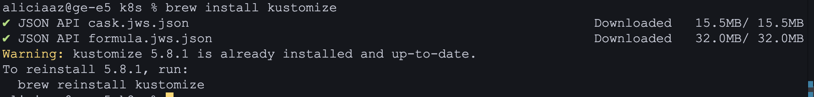

Cоздать скелет проекта развертывания с одной базовой конфигурацией (base) и одной оверлейной конфигурацией (production):

├── base
│   ├── deployment.yaml
│   ├── kustomization.yaml
│   ├── service.yaml
│   └── ...
├── overlays
│   └── production
│       ├── kustomization.yaml
│       ├── configMap.yaml
│       ├── secret.yaml
│       └── ...
├── kustomization.yaml
└── ...

- 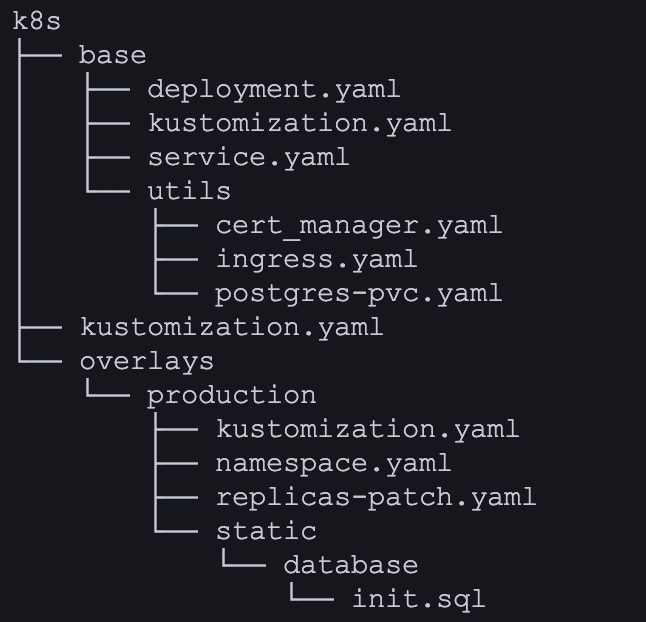

Написать базовые и оверлейные конфигурации для kustomize. В базовых указать сервисы и развертывания, в production добавить конкретные секреты и конфигурационные значения.

- Базовые конфигурации можно наблюдать выше в отчете. В оверлее создал kustomization.yaml, namespace.yaml а так же статичные файлы на основе которых генерируются конфигмапы с секретами:

    <details>
    <summary>kustomization.yaml</summary>
    
    ```yaml
    resources:
    - ../../base
    - namespace.yaml

    namePrefix: prod-
    namespace: production

    commonLabels:
        environment: production

    patchesStrategicMerge:
        - replicas-patch.yaml

    configMapGenerator:
        - name: app-config
        envs:
            - static/.env.template

        - name: postgres-init-script
        files:
            - static/database/init.sql

    replacements:
        - source:
            kind: Service
            name: postgres-service # исходное имя (без префикса)
            fieldPath: metadata.name
        targets:
            - select:
                    kind: ConfigMap
                    name: app-config
                fieldPaths:
                    - data.POSTGRES_HOST
                options:
                    create: true
        - source:
            kind: Service
            name: rabbit-service # исходное имя (без префикса)
            fieldPath: metadata.name
        targets:
            - select:
                    kind: ConfigMap
                    name: app-config
                fieldPaths:
                    - data.RABBIT_MQ_HOST
                options:
                    create: true
        - source:
            kind: Service
            name: session-service # исходное имя (без префикса)
            fieldPath: metadata.name
        targets:
            - select:
                    kind: ConfigMap
                    name: app-config
                fieldPaths:
                    - data.SESSION_SERVICE_HOST
                options:
                    create: true
        - source:
            kind: Service
            name: hotel-service # исходное имя (без префикса)
            fieldPath: metadata.name
        targets:
            - select:
                    kind: ConfigMap
                    name: app-config
                fieldPaths:
                    - data.HOTEL_SERVICE_HOST
                options:
                    create: true
        - source:
            kind: Service
            name: booking-service # исходное имя (без префикса)
            fieldPath: metadata.name
        targets:
            - select:
                    kind: ConfigMap
                    name: app-config
                fieldPaths:
                    - data.BOOKING_SERVICE_HOST
                options:
                    create: true
        - source:
            kind: Service
            name: payment-service # исходное имя (без префикса)
            fieldPath: metadata.name
        targets:
            - select:
                    kind: ConfigMap
                    name: app-config
                fieldPaths:
                    - data.PAYMENT_SERVICE_HOST
                options:
                    create: true
        - source:
            kind: Service
            name: loyalty-service # исходное имя (без префикса)
            fieldPath: metadata.name
        targets:
            - select:
                    kind: ConfigMap
                    name: app-config
                fieldPaths:
                    - data.LOYALTY_SERVICE_HOST
                options:
                    create: true
        - source:
            kind: Service
            name: report-service # исходное имя (без префикса)
            fieldPath: metadata.name
        targets:
            - select:
                    kind: ConfigMap
                    name: app-config
                fieldPaths:
                    - data.REPORT_SERVICE_HOST
                options:
                    create: true
        - source:
            kind: Service
            name: gateway-service # исходное имя (без префикса)
            fieldPath: metadata.name
        targets:
            - select:
                    kind: ConfigMap
                    name: app-config
                fieldPaths:
                    - data.GATEWAY_SERVICE_HOST
                options:
                    create: true

    secretGenerator:
        - name: app-secrets
        envs:
            - static/.env.secret

    ```
    
    </details>

    <details>
    <summary>namespace.yaml</summary>
    
    ```yaml
    apiVersion: v1
    kind: Namespace
    metadata:
        name: production
    ```
    
    </details>

    <details>
    <summary>.env.secret</summary>
    
    ```ini
    POSTGRES_USER=postgres
    POSTGRES_PASSWORD=postgres
    RABBIT_MQ_USER=guest
    RABBIT_MQ_PASSWORD=guest
    AUTH_TOKEN=MIIEvQIBADANBgkqhkiG9w0BAQEFAASCBKcwggSjAgEAAoIBAQC9Q1hl6ossCg5Tr43IW0px2Wz0tDOKRHncreZcew3G+63QuXrLSb5BRh24q0ej4W+Wj8/6RR6vwG1hFtPIBqy6OYUvEdBmOay9eEpzQc2Xy253qSQyxco4FmyNLAwfyk0JS5DKdagT6ct3AqQe9+oGsEHf18CWD/dnYrfKI644uqniI3Lzrk+YnIwZ8BChKMN40qd7XkRuWsJBGEJr+hp1F1KvaYbPz/gqvBJS+IlG37/6mO1xoMaDfPxEUCJbHiWS8PcSeC9TllVVtC+oyPnQzYEbBh7ZfxbwAD3y5FW3qxWN33sQ53XaH7zHondMAQJ6hQROCb6Ml/0bBKfU0hz9AgMBAAECggEANI56Arsx8IXOWrDaZ3PqZVkiZ4WO9mtzh7OGz9GgDsyfBOIs1jzhJ1EoObrehwS4LxA6id4d2mJOPXLQVrB70K7ebCa/P1PuwyKfUghI5kkooPQISE0ijZa0iDNeHonYAKfKSl6H0RfQV3kVSEBB7Z+Oe3F3WnSOmFgSf4CPBdNc240kanQlxsmKjsDmsxLePiYNxU6vDoZt/JKQmSwQUIgznMm7upEmh3UR8q7N757I+dTEhGxs8LLGyvJ2nGnolH9fpkXJlAKHAUvnX1NfUkCgIGiVqpsxwHb5jTmjqpH1U8usaSPZDD0uLf4DLUjIgddpSGcUIjKlaNO9sQXsBQKBgQD5XpNMqgIZgtfEOVJ44auMZqCsIuKXwsICNZmeqSkv5J29ov3V/fkBjDpwiyEXO/9HeFOUEGSNGeFPF4ha0KnNFmeTwDCIPA2vyF3Z049GfRytc4qDqwdplVjgPBPKfrGNmGdHlKKoEHGjpWnuJgOkNhenPKG7zbevpty7TqgluwKBgQDCS6JEl9j34gp5+MoxIbkXt1WOwngnFwRscklTEGJ4wZ3i6GtKIOVzYd7VDqgomB/jnkDQlBK47OzAA54bJBkJ6w83cDGR8D51axYKgKG+Kd8EOeEN4PY+jjKyUpKU3o8o++JKEKs8J2raemb+5YlgiY1ZeDNhL4LrUVa3cIyApwKBgGXo56u6AreoSENx5alvGGt9eYY/j3jT5/N9MjWsDh/7fxeD59avPzcJtsxNn41eQJpVq1pkRKOBgxmOlXP/uJUO5e906KCUYkeHTAt8MR5ufOzJvj7HA3V7ymGBS9lCY49pTDPto3epmLd3H05rDKvsS0hWOAaHMN1BBQ4rO/6HAoGAMQJI/QpcZTJ0OA4EWl5KROwuvaLaEeohaIVvb29bl2AnRjwgDAO+PNt8DLv0uMCekpixeqtPCaxhj5GaCPiTBEhxfydiqZAzAQUw+xc1NTV0lqlO1mRfWKofqZFgfgKhk9HtY4dO2g6LSm7DmhomC97Gc8H5G9OTL25F9GGEX1MCgYEA5CkqAvlJfyCm5lGp2gLMfwElF1oYtgC5xRDpzI6DnMjKhUxeJaMgRkam3mvMA0zg58ZTY9q+CeSSyDohNZpLDZomG7mEuNDWAPbpafo9g8q1g7ucWGeFRgVAmf0xmnJHHmAqODdT9X02abJZMumawCRDtRpPKvNtamO9jex9YgM=
    ```
    
    </details>

    <details>
    <summary>.env.template</summary>
    
    ```ini
    POSTGRES_HOST=${postgres_service}
    POSTGRES_PORT=5432
    RABBIT_MQ_HOST=${rabbit_service}
    RABBIT_MQ_PORT=5672
    RABBIT_MQ_QUEUE_NAME=messagequeue
    RABBIT_MQ_EXCHANGE=messagequeue-exchange
    SESSION_SERVICE_HOST=${session_service}
    SESSION_SERVICE_PORT=8081
    HOTEL_SERVICE_HOST=${hotel_service}
    HOTEL_SERVICE_PORT=8082
    BOOKING_SERVICE_HOST=${booking_service}
    BOOKING_SERVICE_PORT=8083
    PAYMENT_SERVICE_HOST=${payment_service}
    PAYMENT_SERVICE_PORT=8084
    LOYALTY_SERVICE_HOST=${loyalty_service}
    LOYALTY_SERVICE_PORT=8085
    REPORT_SERVICE_HOST=${report_service}
    REPORT_SERVICE_PORT=8086
    GATEWAY_SERVICE_HOST=${gateway_service}
    GATEWAY_SERVICE_PORT=8087
    ```
    
    </details>


Создать replicas-patch.yaml для оверлей production, который модифицирует количество реплик для деплоймента gateway service до 3 реплик.

-   <details>
    <summary>.replicas-patch.yaml</summary>
    
    ```yaml
    apiVersion: apps/v1
    kind: Deployment
    metadata:
        name: gateway-service
    spec:
        replicas: 3
    ```
    
    </details>

Собрать результирующий конфигурационный файл, учитывая оверлей production.

- Результирующий файл находится в корне k8s папки под названием main.yaml
    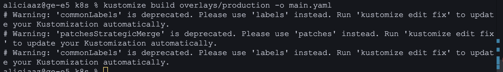

Запустить функциональные тесты Postman и удостовериться в работоспособности приложения.

- 
    Для полной функциональности приложения были проведены все те же операции над машинами, что и в прошлом проекте.

Part 2. Развертывание приложения с помощью Helm
Задание
Получить набор виртуальных машин с развернутым кластером.

- Для виртуалок использовал Vagrantfile
    <details>
    <summary>Vagrantfile</summary>
    
    ```ruby
    Vagrant.configure("2") do |config|
    config.vm.box = "ubuntu/jammy64"
    config.vm.provider "virtualbox" do |vb|
      vb.memory = "4096"
      vb.cpus = 2
      vb.customize ["modifyvm", :id, "--nictype1", "82540EM"]
      vb.customize ["modifyvm", :id, "--nictype2", "82540EM"]
    end
  
    config.vm.provision "shell", inline: "apt update && apt upgrade -y", name: "update_upgrade"
    config.vm.provision "shell", inline: "sudo swapoff -a", name: "swap"
    config.vm.synced_folder "./src", "/home/vagrant/src"
  
    config.vm.define "manager01" do |manager|
      manager.vm.hostname = "manager01"
      manager.vm.network "private_network", ip: "192.168.56.11"
      
      manager.vm.network "forwarded_port", guest: 8087, host: 8087, host_ip: "127.0.0.1", id: "nginx_api_8087"
      manager.vm.network "forwarded_port", guest: 8081, host: 8081, host_ip: "127.0.0.1", id: "nginx_api_8081"

      manager.vm.provision "shell", inline: 'curl -sfL https://get.k3s.io | INSTALL_K3S_EXEC="--disable=traefik --node-ip=192.168.56.11 --flannel-backend=host-gw" sh - && cp /var/lib/rancher/k3s/server/node-token /home/vagrant/src/node-token', name: "install_manager"
    end
  
    config.vm.define "worker01" do |worker|
      worker.vm.hostname = "worker01"
      worker.vm.network "private_network", ip: "192.168.56.12"
      worker.vm.provision "shell", inline: 'sleep 10 && sudo curl -sfL https://get.k3s.io | K3S_URL=https://192.168.56.11:6443 INSTALL_K3S_EXEC="--node-ip=192.168.56.12" K3S_TOKEN=$(cat /home/vagrant/src/node-token) sh -', name: "join_worker"
    end
  
    config.vm.define "worker02" do |worker|
      worker.vm.hostname = "worker02"
      worker.vm.network "private_network", ip: "192.168.56.13"
      worker.vm.provision "shell", inline: 'sleep 10 && sudo curl -sfL https://get.k3s.io | K3S_URL=https://192.168.56.11:6443 INSTALL_K3S_EXEC="--node-ip=192.168.56.13" K3S_TOKEN=$(cat /home/vagrant/src/node-token) sh -', name: "join_worker"
    end
  end
    ```

    </details>

Перенести манифесты из предыдущих блоков.

- Все перенесенные манифесты находятся в папке helm в src проекта

Установить helm на локальной машине и удостовериться, что этот инструмент имеет валидное подключение к полученному удаленному кластеру Kubernetes.

- 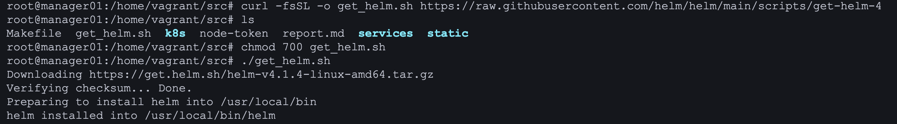

    Для проверки доступа к кластеру используем helm list:
- 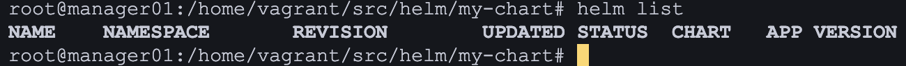

Создать helm-чарты и шаблоны для своего приложения с помощью команды helm create. Эта команда создаст базовую структуру чарта с шаблонами для ресурсов: deployment, service и ingress.

- 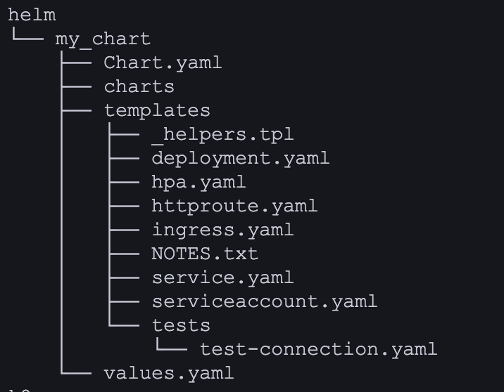

Отредактировать файл values.yaml на диаграмме, чтобы указать параметры конфигурации для твоего приложения, необходимые для создания манифестов Kubernetes для указанных развертываний (deployments). Описать объекты развертывания и сервисов в директории шаблонов (templates).

-   
    <details>
    <summary>values.yaml</summary>
    
    ```
    replicaCount: 1
    strategy:
        type: Recreate

    httpRoute:
        enabled: false

    imagePullPolicy: IfNotPresent

    configMap:
        name: app-config
        data:
            SESSION_SERVICE_HOST: "session-service"
            SESSION_SERVICE_PORT: "8081"
            HOTEL_SERVICE_HOST: "hotel-service"
            HOTEL_SERVICE_PORT: "8082"
            BOOKING_SERVICE_HOST: "booking-service"
            BOOKING_SERVICE_PORT: "8083"
            PAYMENT_SERVICE_HOST: "payment-service"
            PAYMENT_SERVICE_PORT: "8084"
            LOYALTY_SERVICE_HOST: "loyalty-service"
            LOYALTY_SERVICE_PORT: "8085"
            REPORT_SERVICE_HOST: "report-service"
            REPORT_SERVICE_PORT: "8086"
            POSTGRES_HOST: "postgres-service"
            POSTGRES_PORT: "5432"
            RABBIT_MQ_HOST: "rabbit-service"
            RABBIT_MQ_PORT: "5672"
            RABBIT_MQ_QUEUE_NAME: "booking_queue"
            RABBIT_MQ_EXCHANGE: "booking_exchange"
            test: "test"

    secrets:
        name: app-secrets
        POSTGRES_USER: "postgres"
        POSTGRES_PASSWORD: "postgres"
        RABBIT_MQ_USER: "guest"
        RABBIT_MQ_PASSWORD: "guest"
        AUTH_TOKEN: "MIIEvQIBADANBgkqhkiG9w0BAQEFAASCBKcwggSjAgEAAoIBAQC9Q1hl6ossCg5Tr43IW0px2Wz0tDOKRHncreZcew3G+63QuXrLSb5BRh24q0ej4W+Wj8/6RR6vwG1hFtPIBqy6OYUvEdBmOay9eEpzQc2Xy253qSQyxco4FmyNLAwfyk0JS5DKdagT6ct3AqQe9+oGsEHf18CWD/dnYrfKI644uqniI3Lzrk+YnIwZ8BChKMN40qd7XkRuWsJBGEJr+hp1F1KvaYbPz/gqvBJS+IlG37/6mO1xoMaDfPxEUCJbHiWS8PcSeC9TllVVtC+oyPnQzYEbBh7ZfxbwAD3y5FW3qxWN33sQ53XaH7zHondMAQJ6hQROCb6Ml/0bBKfU0hz9AgMBAAECggEANI56Arsx8IXOWrDaZ3PqZVkiZ4WO9mtzh7OGz9GgDsyfBOIs1jzhJ1EoObrehwS4LxA6id4d2mJOPXLQVrB70K7ebCa/P1PuwyKfUghI5kkooPQISE0ijZa0iDNeHonYAKfKSl6H0RfQV3kVSEBB7Z+Oe3F3WnSOmFgSf4CPBdNc240kanQlxsmKjsDmsxLePiYNxU6vDoZt/JKQmSwQUIgznMm7upEmh3UR8q7N757I+dTEhGxs8LLGyvJ2nGnolH9fpkXJlAKHAUvnX1NfUkCgIGiVqpsxwHb5jTmjqpH1U8usaSPZDD0uLf4DLUjIgddpSGcUIjKlaNO9sQXsBQKBgQD5XpNMqgIZgtfEOVJ44auMZqCsIuKXwsICNZmeqSkv5J29ov3V/fkBjDpwiyEXO/9HeFOUEGSNGeFPF4ha0KnNFmeTwDCIPA2vyF3Z049GfRytc4qDqwdplVjgPBPKfrGNmGdHlKKoEHGjpWnuJgOkNhenPKG7zbevpty7TqgluwKBgQDCS6JEl9j34gp5+MoxIbkXt1WOwngnFwRscklTEGJ4wZ3i6GtKIOVzYd7VDqgomB/jnkDQlBK47OzAA54bJBkJ6w83cDGR8D51axYKgKG+Kd8EOeEN4PY+jjKyUpKU3o8o++JKEKs8J2raemb+5YlgiY1ZeDNhL4LrUVa3cIyApwKBgGXo56u6AreoSENx5alvGGt9eYY/j3jT5/N9MjWsDh/7fxeD59avPzcJtsxNn41eQJpVq1pkRKOBgxmOlXP/uJUO5e906KCUYkeHTAt8MR5ufOzJvj7HA3V7ymGBS9lCY49pTDPto3epmLd3H05rDKvsS0hWOAaHMN1BBQ4rO/6HAoGAMQJI/QpcZTJ0OA4EWl5KROwuvaLaEeohaIVvb29bl2AnRjwgDAO+PNt8DLv0uMCekpixeqtPCaxhj5GaCPiTBEhxfydiqZAzAQUw+xc1NTV0lqlO1mRfWKofqZFgfgKhk9HtY4dO2g6LSm7DmhomC97Gc8H5G9OTL25F9GGEX1MCgYEA5CkqAvlJfyCm5lGp2gLMfwElF1oYtgC5xRDpzI6DnMjKhUxeJaMgRkam3mvMA0zg58ZTY9q+CeSSyDohNZpLDZomG7mEuNDWAPbpafo9g8q1g7ucWGeFRgVAmf0xmnJHHmAqODdT9X02abJZMumawCRDtRpPKvNtamO9jex9YgM="

    services:
        gateway-service:
            enabled: true
            image:
                repository: xedll/gateway-service
                tag: latest
            port: 8087
            env:
            - name: SESSION_SERVICE_HOST
                valueFrom:
                    configMapKeyRef:
                        name: app-config
                        key: SESSION_SERVICE_HOST
            - name: SESSION_SERVICE_PORT
                valueFrom:
                    configMapKeyRef:
                        name: app-config
                        key: SESSION_SERVICE_PORT
            - name: HOTEL_SERVICE_HOST
                valueFrom:
                    configMapKeyRef:
                        name: app-config
                        key: HOTEL_SERVICE_HOST
            - name: HOTEL_SERVICE_PORT
                valueFrom:
                    configMapKeyRef:
                        name: app-config
                        key: HOTEL_SERVICE_PORT
            - name: BOOKING_SERVICE_HOST
                valueFrom:
                    configMapKeyRef:
                        name: app-config
                        key: BOOKING_SERVICE_HOST
            - name: BOOKING_SERVICE_PORT
                valueFrom:
                    configMapKeyRef:
                        name: app-config
                        key: BOOKING_SERVICE_PORT
            - name: PAYMENT_SERVICE_HOST
                valueFrom:
                    configMapKeyRef:
                        name: app-config
                        key: PAYMENT_SERVICE_HOST
            - name: PAYMENT_SERVICE_PORT
                valueFrom:
                    configMapKeyRef:
                        name: app-config
                        key: PAYMENT_SERVICE_PORT
            - name: LOYALTY_SERVICE_HOST
                valueFrom:
                    configMapKeyRef:
                        name: app-config
                        key: LOYALTY_SERVICE_HOST
            - name: LOYALTY_SERVICE_PORT
                valueFrom:
                    configMapKeyRef:
                        name: app-config
                        key: LOYALTY_SERVICE_PORT
            - name: REPORT_SERVICE_HOST
                valueFrom:
                    configMapKeyRef:
                        name: app-config
                        key: REPORT_SERVICE_HOST
            - name: REPORT_SERVICE_PORT
                valueFrom:
                    configMapKeyRef:
                        name: app-config
                        key: REPORT_SERVICE_PORT
            - name: AUTH_TOKEN
                valueFrom:
                    secretKeyRef:
                        name: app-secrets
                        key: AUTH_TOKEN
            service:
                port: 8087
                targetPort: 8087

        booking-service:
            enabled: true
            image:
                repository: xedll/booking-service
                tag: latest
            port: 8083
            env:
            - name: POSTGRES_HOST
                valueFrom:
                    configMapKeyRef:
                        name: app-config
                        key: POSTGRES_HOST
            - name: POSTGRES_PORT
                valueFrom:
                    configMapKeyRef:
                        name: app-config
                        key: POSTGRES_PORT
            - name: POSTGRES_USER
                valueFrom:
                    secretKeyRef:
                        name: app-secrets
                        key: POSTGRES_USER
            - name: POSTGRES_PASSWORD
                valueFrom:
                    secretKeyRef:
                        name: app-secrets
                        key: POSTGRES_PASSWORD
            - name: POSTGRES_DB
                value: "reservations_db"
            - name: RABBIT_MQ_HOST
                valueFrom:
                    configMapKeyRef:
                        name: app-config
                        key: RABBIT_MQ_HOST
            - name: RABBIT_MQ_PORT
                valueFrom:
                    configMapKeyRef:
                        name: app-config
                        key: RABBIT_MQ_PORT
            - name: RABBIT_MQ_USER
                valueFrom:
                    secretKeyRef:
                        name: app-secrets
                        key: RABBIT_MQ_USER
            - name: RABBIT_MQ_PASSWORD
                valueFrom:
                    secretKeyRef:
                        name: app-secrets
                        key: RABBIT_MQ_PASSWORD
            - name: RABBIT_MQ_QUEUE_NAME
                valueFrom:
                    configMapKeyRef:
                        name: app-config
                        key: RABBIT_MQ_QUEUE_NAME
            - name: RABBIT_MQ_EXCHANGE
                valueFrom:
                    configMapKeyRef:
                        name: app-config
                        key: RABBIT_MQ_EXCHANGE
            - name: HOTEL_SERVICE_HOST
                valueFrom:
                    configMapKeyRef:
                        name: app-config
                        key: HOTEL_SERVICE_HOST
            - name: HOTEL_SERVICE_PORT
                valueFrom:
                    configMapKeyRef:
                        name: app-config
                        key: HOTEL_SERVICE_PORT
            - name: PAYMENT_SERVICE_HOST
                valueFrom:
                    configMapKeyRef:
                        name: app-config
                        key: PAYMENT_SERVICE_HOST
            - name: PAYMENT_SERVICE_PORT
                valueFrom:
                    configMapKeyRef:
                        name: app-config
                        key: PAYMENT_SERVICE_PORT
            - name: LOYALTY_SERVICE_HOST
                valueFrom:
                    configMapKeyRef:
                        name: app-config
                        key: LOYALTY_SERVICE_HOST
            - name: LOYALTY_SERVICE_PORT
                valueFrom:
                    configMapKeyRef:
                        name: app-config
                        key: LOYALTY_SERVICE_PORT
            - name: AUTH_TOKEN
                valueFrom:
                    secretKeyRef:
                        name: app-secrets
                        key: AUTH_TOKEN
            service:
                port: 8083
                targetPort: 8083

        hotel-service:
            enabled: true
            image:
                repository: xedll/hotel-service
                tag: latest
            port: 8082
            env:
            - name: POSTGRES_HOST
                valueFrom:
                    configMapKeyRef:
                        name: app-config
                        key: POSTGRES_HOST
            - name: POSTGRES_PORT
                valueFrom:
                    configMapKeyRef:
                        name: app-config
                        key: POSTGRES_PORT
            - name: POSTGRES_USER
                valueFrom:
                    secretKeyRef:
                        name: app-secrets
                        key: POSTGRES_USER
            - name: POSTGRES_PASSWORD
                valueFrom:
                    secretKeyRef:
                        name: app-secrets
                        key: POSTGRES_PASSWORD
            - name: POSTGRES_DB
                value: "hotels_db"
            - name: AUTH_TOKEN
                valueFrom:
                    secretKeyRef:
                        name: app-secrets
                        key: AUTH_TOKEN
            service:
                port: 8082
                targetPort: 8082

        loyalty-service:
            enabled: true
            image:
                repository: xedll/loyalty-service
                tag: latest
            port: 8085
            env:
            - name: POSTGRES_HOST
                valueFrom:
                    configMapKeyRef:
                        name: app-config
                        key: POSTGRES_HOST
            - name: POSTGRES_PORT
                valueFrom:
                    configMapKeyRef:
                        name: app-config
                        key: POSTGRES_PORT
            - name: POSTGRES_USER
                valueFrom:
                    secretKeyRef:
                        name: app-secrets
                        key: POSTGRES_USER
            - name: POSTGRES_PASSWORD
                valueFrom:
                    secretKeyRef:
                        name: app-secrets
                        key: POSTGRES_PASSWORD
            - name: POSTGRES_DB
                value: "balances_db"
            - name: AUTH_TOKEN
                valueFrom:
                    secretKeyRef:
                        name: app-secrets
                        key: AUTH_TOKEN
            service:
                port: 8085
                targetPort: 8085

        payment-service:
            enabled: true
            image:
                repository: xedll/payment-service
                tag: latest
            port: 8084
            env:
            - name: POSTGRES_HOST
                valueFrom:
                    configMapKeyRef:
                        name: app-config
                        key: POSTGRES_HOST
            - name: POSTGRES_PORT
                valueFrom:
                    configMapKeyRef:
                        name: app-config
                        key: POSTGRES_PORT
            - name: POSTGRES_USER
                valueFrom:
                    secretKeyRef:
                        name: app-secrets
                        key: POSTGRES_USER
            - name: POSTGRES_PASSWORD
                valueFrom:
                    secretKeyRef:
                        name: app-secrets
                        key: POSTGRES_PASSWORD
            - name: POSTGRES_DB
                value: "payments_db"
            - name: AUTH_TOKEN
                valueFrom:
                    secretKeyRef:
                        name: app-secrets
                        key: AUTH_TOKEN
            service:
                port: 8084
                targetPort: 8084

        postgres-service:
            enabled: true
            image:
                repository: postgres
                tag: 13-alpine
            port: 5432
            env:
            - name: POSTGRES_USER
                valueFrom:
                    secretKeyRef:
                        name: app-secrets
                        key: POSTGRES_USER
            - name: POSTGRES_PASSWORD
                valueFrom:
                    secretKeyRef:
                        name: app-secrets
                        key: POSTGRES_PASSWORD
            - name: POSTGRES_DB
                value: "postgres"
            volumeMounts:
            - name: postgres-storage
                mountPath: /var/lib/postgresql/data
                subPath: pgdata
            - name: postgres-init-script
                mountPath: /docker-entrypoint-initdb.d
                readOnly: true
            volumes:
            - name: postgres-storage
                persistentVolumeClaim:
                    claimName: postgres-pvc2
            - name: postgres-init-script
                configMap:
                    name: postgres-init-script
                    defaultMode: 755
            service:
                port: 5432
                targetPort: 5432

        rabbit-service:
            enabled: true
            image:
                repository: rabbitmq
                tag: 3-management-alpine
            ports:
            - containerPort: 5672
            - containerPort: 15672
            env:
            - name: RABBITMQ_DEFAULT_USER
                valueFrom:
                    secretKeyRef:
                        name: app-secrets
                        key: RABBIT_MQ_USER
            - name: RABBITMQ_DEFAULT_PASS
                valueFrom:
                    secretKeyRef:
                        name: app-secrets
                        key: RABBIT_MQ_PASSWORD
            service:
                ports:
                - name: amqp
                    port: 5672
                    targetPort: 5672
                - name: management
                    port: 15672
                    targetPort: 15672

        report-service:
            enabled: true
            image:
                repository: xedll/report-service
                tag: latest
            port: 8086
            env:
            - name: POSTGRES_HOST
                valueFrom:
                    configMapKeyRef:
                        name: app-config
                        key: POSTGRES_HOST
            - name: POSTGRES_PORT
                valueFrom:
                    configMapKeyRef:
                        name: app-config
                        key: POSTGRES_PORT
            - name: POSTGRES_USER
                valueFrom:
                    secretKeyRef:
                        name: app-secrets
                        key: POSTGRES_USER
            - name: POSTGRES_PASSWORD
                valueFrom:
                    secretKeyRef:
                        name: app-secrets
                        key: POSTGRES_PASSWORD
            - name: POSTGRES_DB
                value: "statistics_db"
            - name: RABBIT_MQ_HOST
                valueFrom:
                    configMapKeyRef:
                        name: app-config
                        key: RABBIT_MQ_HOST
            - name: RABBIT_MQ_PORT
                valueFrom:
                    configMapKeyRef:
                        name: app-config
                        key: RABBIT_MQ_PORT
            - name: RABBIT_MQ_USER
                valueFrom:
                    secretKeyRef:
                        name: app-secrets
                        key: RABBIT_MQ_USER
            - name: RABBIT_MQ_PASSWORD
                valueFrom:
                    secretKeyRef:
                        name: app-secrets
                        key: RABBIT_MQ_PASSWORD
            - name: RABBIT_MQ_QUEUE_NAME
                valueFrom:
                    configMapKeyRef:
                        name: app-config
                        key: RABBIT_MQ_QUEUE_NAME
            - name: RABBIT_MQ_EXCHANGE
                valueFrom:
                    configMapKeyRef:
                        name: app-config
                        key: RABBIT_MQ_EXCHANGE
            - name: AUTH_TOKEN
                valueFrom:
                    secretKeyRef:
                        name: app-secrets
                        key: AUTH_TOKEN
            service:
                port: 8086
                targetPort: 8086

        session-service:
            enabled: true
            image:
                repository: xedll/session-service
                tag: latest
            port: 8081
            env:
            - name: POSTGRES_HOST
                valueFrom:
                    configMapKeyRef:
                        name: app-config
                        key: POSTGRES_HOST
            - name: POSTGRES_PORT
                valueFrom:
                    configMapKeyRef:
                        name: app-config
                        key: POSTGRES_PORT
            - name: POSTGRES_USER
                valueFrom:
                    secretKeyRef:
                        name: app-secrets
                        key: POSTGRES_USER
            - name: POSTGRES_PASSWORD
                valueFrom:
                    secretKeyRef:
                        name: app-secrets
                        key: POSTGRES_PASSWORD
            - name: POSTGRES_DB
                value: "users_db"
            - name: AUTH_TOKEN
                valueFrom:
                    secretKeyRef:
                        name: app-secrets
                        key: AUTH_TOKEN
            service:
                port: 8081
                targetPort: 8081

    persistence:
        enabled: true
        storageClassName: ""
        accessMode: ReadWriteOnce
        size: 1Gi

    postgresInitScript: |
        \c postgres;
        DROP DATABASE IF EXISTS users_db;
        CREATE DATABASE users_db OWNER postgres;

        DROP DATABASE IF EXISTS hotels_db;
        CREATE DATABASE hotels_db OWNER postgres;

        DROP DATABASE IF EXISTS reservations_db;
        CREATE DATABASE reservations_db OWNER postgres;

        DROP DATABASE IF EXISTS payments_db;
        CREATE DATABASE payments_db OWNER postgres;

        DROP DATABASE IF EXISTS balances_db;
        CREATE DATABASE balances_db OWNER postgres;

        DROP DATABASE IF EXISTS statistics_db;
        CREATE DATABASE statistics_db OWNER postgres;

    certManager:
        enabled: false
        clusterIssuer:
            name: selfsigned-issuer
            selfSigned: {}
        certificate:
            name: wildcard-cert
            secretName: my-wildcard-tls
            commonName: "*.do11.com"
            dnsNames:
            - "do11.com"
            - "*.do11.com"

    ingress:
        ingressClassName: nginx
        enabled: true
        name: my-app-ingress
        annotations:
            kubernetes.io/ingress.class: nginx
        tls:
            hosts:
            - app.do11.com
            secretName: my-wildcard-tls
        rules:
        - host: app.do11.com
            paths:
            - path: /api/v1/gateway
                pathType: Prefix
                service:
                    name: gateway-service
                    port: 8087
            - path: /api/v1/auth/authorize
                pathType: Prefix
                service:
                    name: session-service
                    port: 8081

    postgresPV:
        enabled: true
        name: postgres-pv2
        capacity: 5Gi
        accessModes:
        - ReadWriteOnce
        persistentVolumeReclaimPolicy: Retain
        storageClassName: manual
        hostPath: "/mnt/data/postgres"

    postgresPVC:
        enabled: true
        name: postgres-pvc2
        accessModes:
        - ReadWriteOnce
        storageClassName: manual
        storage: 5Gi

    ```
    
    </details>
    
    Остальные шаблоны находятся в соответствующей папке


Упаковать helm-чарт с помощью команды helm package для создания файла *.tgz, содержащего чарт и его зависимости.

- 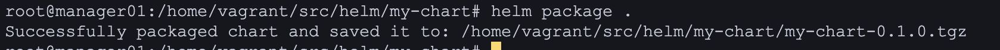

Развернуть helm-чарт в кластере Kubernetes с помощью команды helm install. Указать произвольный namespace и release-name.

- 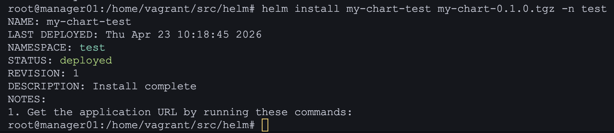

    Смотрим на изменение
    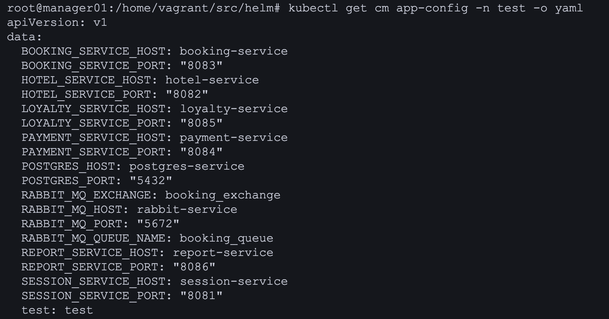

Проверить статус развернутого приложения при помощи команды kubectl get. Результаты представить в отчете.

- 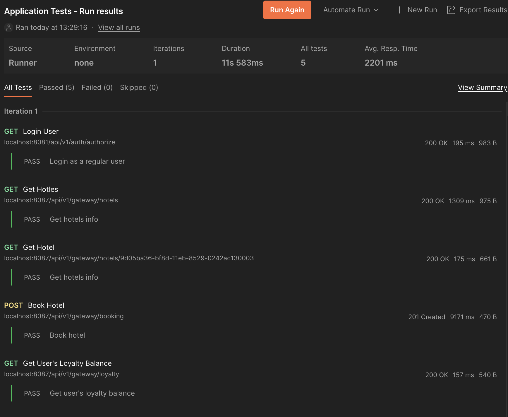

Внести как минимум одно изменение в values.yaml и выполнить команду helm upgrade.

- 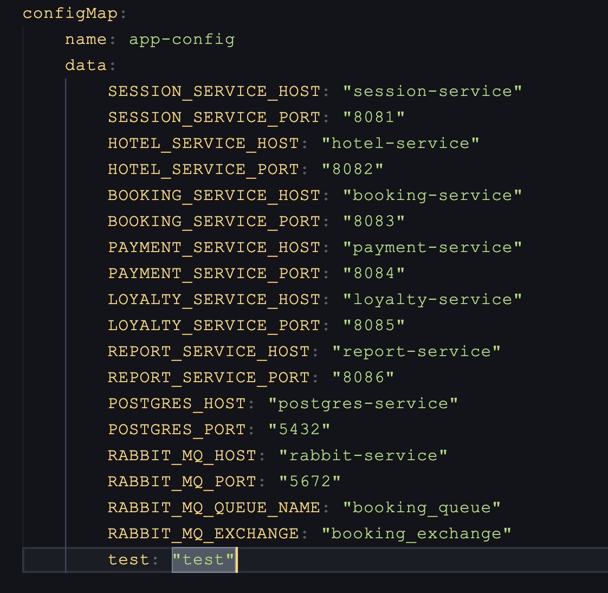

- 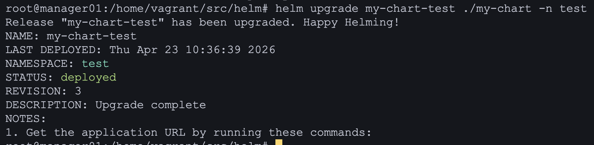

- 

Запустить функциональные тесты Postman и удостовериться в работоспособности приложения.

- 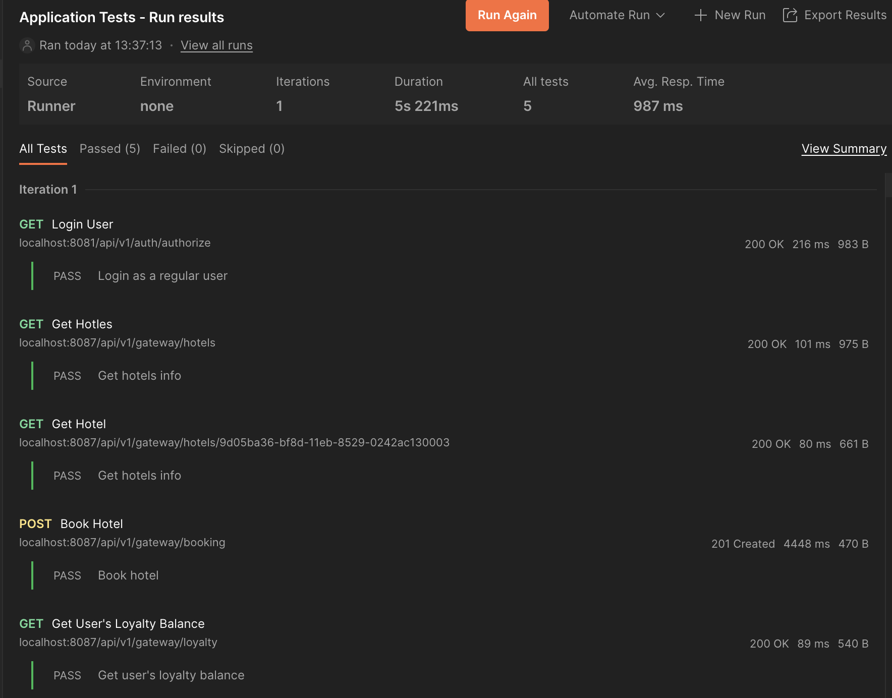