## Part 1. Готовый докер

#### Возьми официальный докер-образ с nginx и выкачай его при помощи docker pull.

- 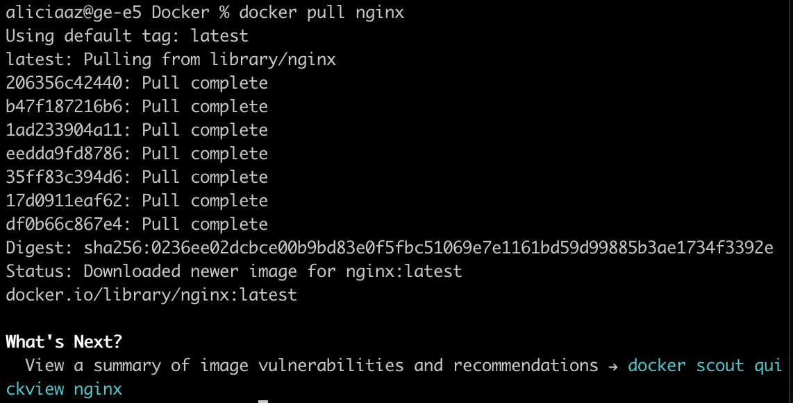

#### Проверь наличие докер-образа через docker images.

- 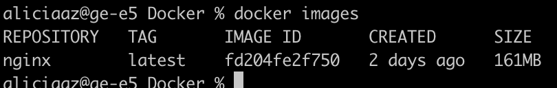

#### Запусти докер-образ через docker run -d [image_id|repository].

- 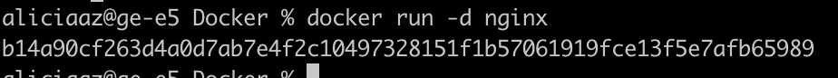

#### Проверь, что образ запустился через docker ps.

- 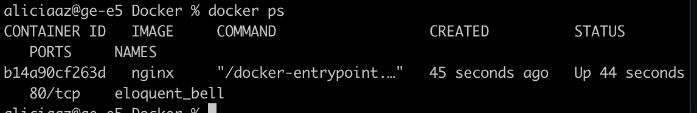

#### Посмотри информацию о контейнере через docker inspect [container_id|container_name].

#### По выводу команды определи и помести в отчёт размер контейнера, список замапленных портов и ip контейнера.

- 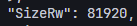

- 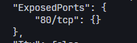

- 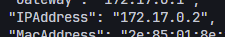

-  Размер: 160854769 байт, Список портов: 80/tcp, IP контейнера: 172.17.0.2

#### Останови докер контейнер через docker stop [container_id|container_name].

- 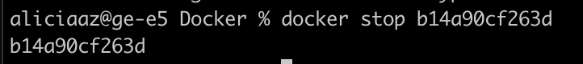

#### Проверь, что контейнер остановился через docker ps.

- 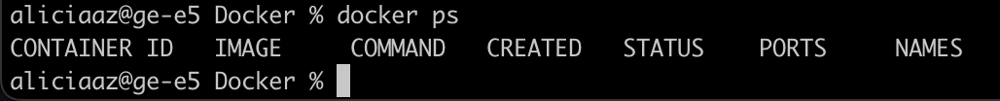

#### Запусти докер с портами 80 и 443 в контейнере, замапленными на такие же порты на локальной машине, через команду run.

- 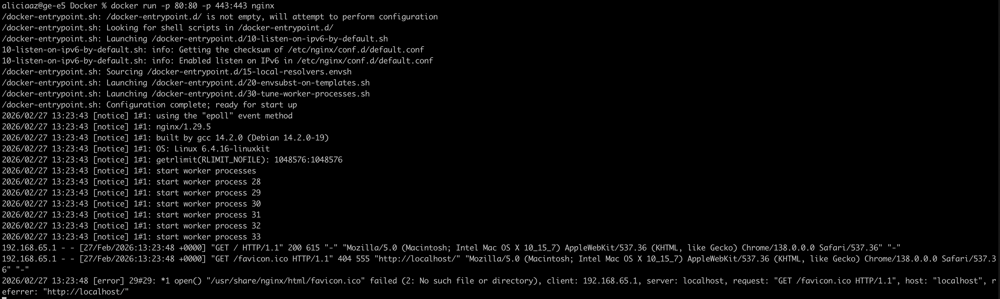

#### Проверь, что в браузере по адресу localhost:80 доступна стартовая страница nginx.

- 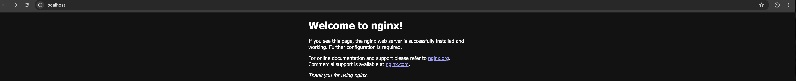

#### Перезапусти докер контейнер через docker restart [container_id|container_name].

#### Проверь любым способом, что контейнер запустился.

- 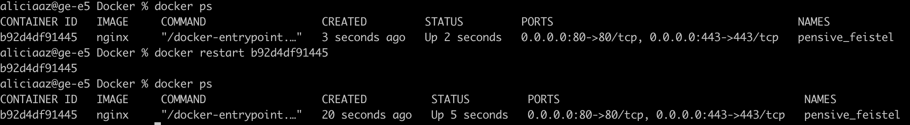

## Part 2. Операции с контейнером

#### Прочитай конфигурационный файл nginx.conf внутри докер контейнера через команду exec.

- 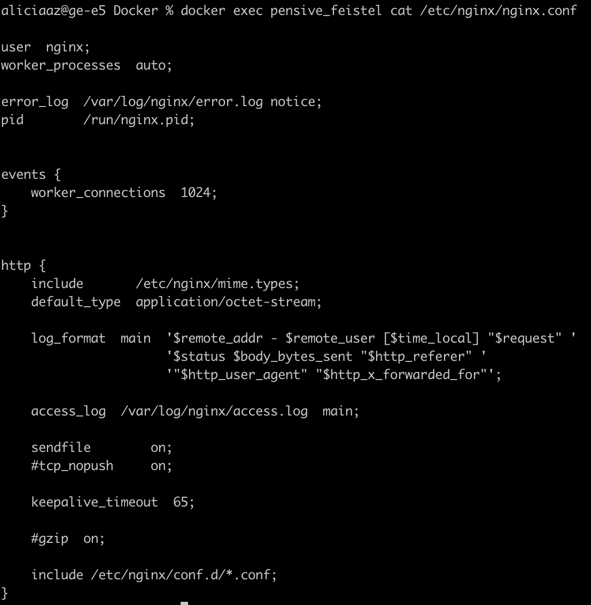

#### Создай на локальной машине файл nginx.conf.

#### Настрой в нем по пути /status отдачу страницы статуса сервера nginx.

- 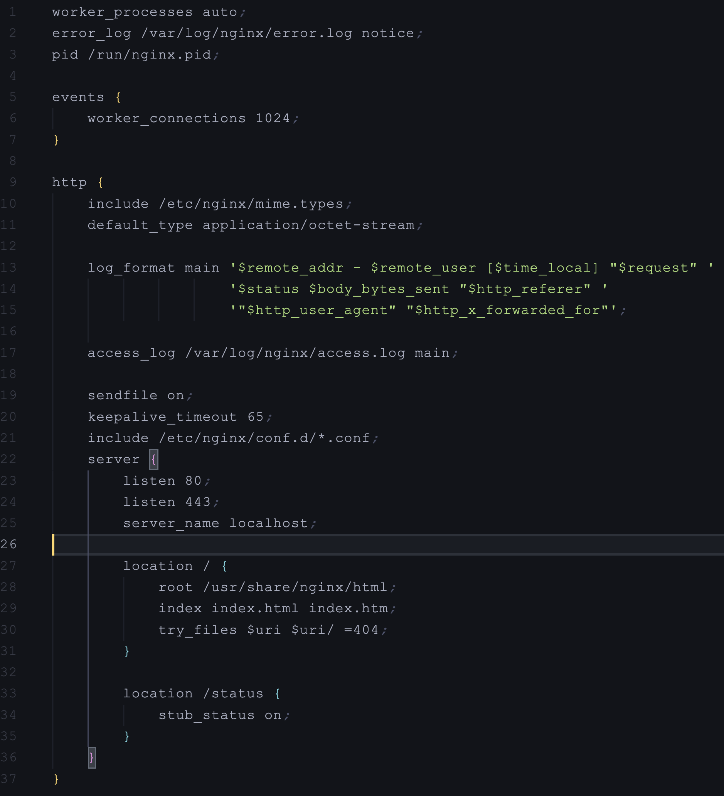

#### Скопируй созданный файл nginx.conf внутрь докер-образа через команду docker cp.

- 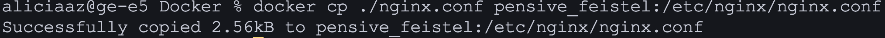

#### Перезапусти nginx внутри докер-образа через команду exec.

- 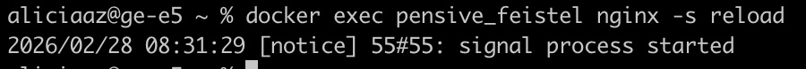

#### Проверь, что по адресу localhost:80/status отдается страничка со статусом сервера nginx.

- 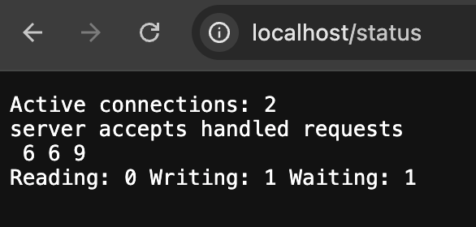

#### Экспортируй контейнер в файл container.tar через команду export.

- 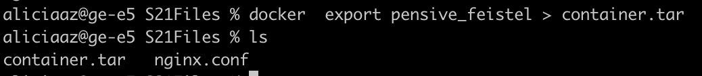

#### Останови контейнер.

#### Удали образ через docker rmi [image_id|repository], не удаляя перед этим контейнеры.

#### Удали остановленный контейнер.

- 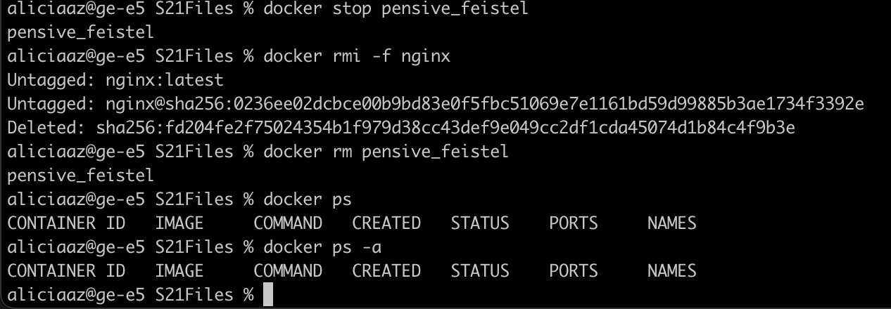

#### Импортируй контейнер обратно через команду import.

#### Запусти импортированный контейнер.

- 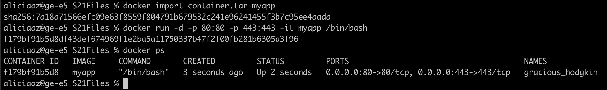

#### Проверь, что по адресу localhost:80/status отдается страничка со статусом сервера nginx.

- 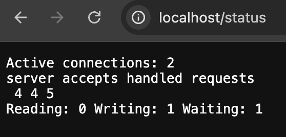

## Part 3. Мини веб-сервер

##### Напиши мини-сервер на **C** и **FastCgi**, который будет возвращать простейшую страничку с надписью `Hello, World!`.
##### Запусти написанный мини-сервер через *spawn-fcgi* на порту 8080.

- 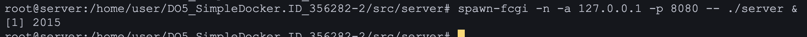

##### Напиши свой *nginx.conf*, который будет проксировать все запросы с 81 порта на *127.0.0.1:8080*.
##### Запусти локально **nginx** с написанной конфигурацией.

- 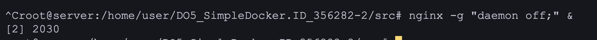

##### Проверь, что в браузере по *localhost:81* отдается написанная тобой страничка.

- 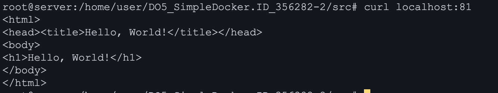

##### Положи файл *nginx.conf* по пути *./nginx/nginx.conf* (это понадобится позже).

## Part 4. Свой докер

*При написании докер-образа избегай множественных вызовов команд RUN*

#### Напиши свой докер-образ, который:
##### 1) собирает исходники мини сервера на FastCgi из [Части 3](#part-3-мини-веб-сервер);
##### 2) запускает его на 8080 порту;
##### 3) копирует внутрь образа написанный *./nginx/nginx.conf*;
##### 4) запускает **nginx**.
_**nginx** можно установить внутрь докера самостоятельно, а можно воспользоваться готовым образом с **nginx**'ом, как базовым._

##### Собери написанный докер-образ через `docker build` при этом указав имя и тег.

- 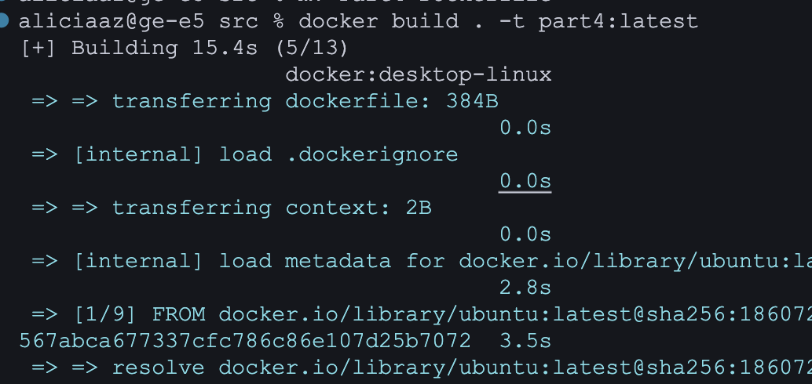

##### Проверь через `docker images`, что все собралось корректно.

- 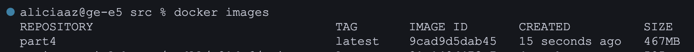

##### Запусти собранный докер-образ с маппингом 81 порта на 80 на локальной машине и маппингом папки *./nginx* внутрь контейнера по адресу, где лежат конфигурационные файлы **nginx**'а (см. [Часть 2](#part-2-операции-с-контейнером)).

- 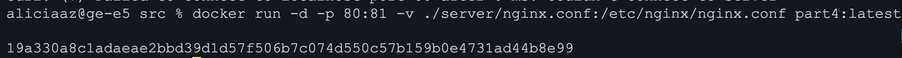

##### Проверь, что по localhost:80 доступна страничка написанного мини сервера.

- 

##### Допиши в *./nginx/nginx.conf* проксирование странички */status*, по которой надо отдавать статус сервера **nginx**.
##### Пересобери докер-образ.
*Если всё сделано верно, то, после сохранения файла и перезапуска контейнера, конфигурационный файл внутри докер-образа должен обновиться самостоятельно без лишних действий*.
##### Проверь, что теперь по *localhost:80/status* отдается страничка со статусом **nginx**

- 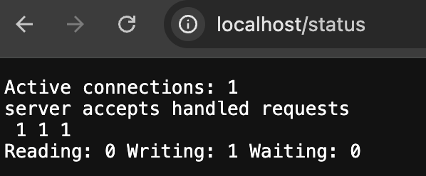

## Part 5. **Dockle**

##### Просканируй образ из предыдущего задания через `dockle [image_id|repository]`.

- 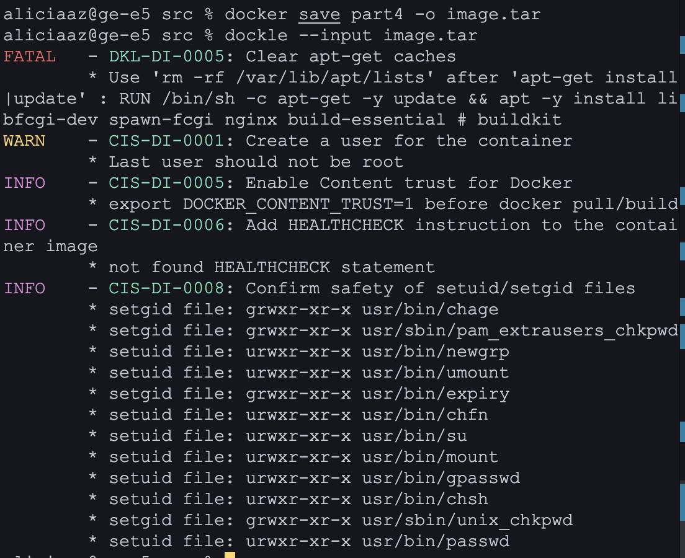

##### Исправь образ так, чтобы при проверке через **dockle** не было ошибок и предупреждений.

- 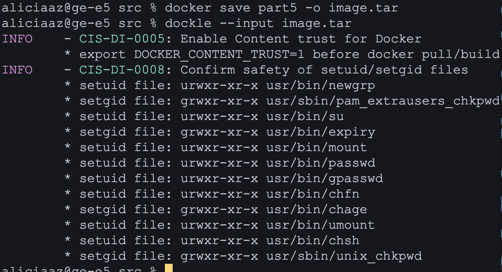

## Part 6. Базовый **Docker Compose**

##### Напиши файл *docker-compose.yml*, с помощью которого:
##### 1) Подними докер-контейнер из [Части 5](#part-5-инструмент-dockle) _(он должен работать в локальной сети, т. е. не нужно использовать инструкцию **EXPOSE** и мапить порты на локальную машину)_.
##### 2) Подними докер-контейнер с **nginx**, который будет проксировать все запросы с 8080 порта на 81 порт первого контейнера.
##### Замапь 8080 порт второго контейнера на 80 порт локальной машины.

##### Останови все запущенные контейнеры.

- 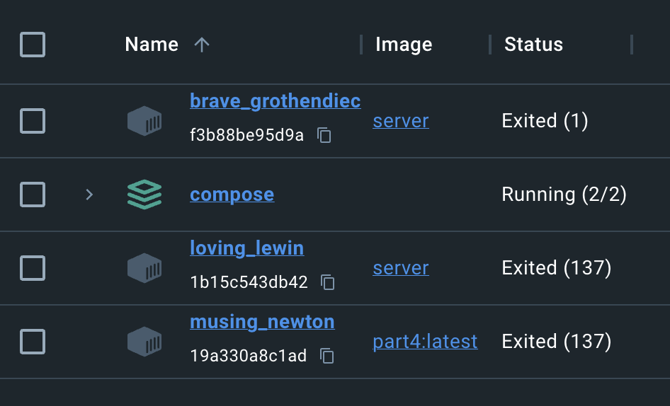

##### Собери и запусти проект с помощью команд `docker-compose build` и `docker-compose up`.

- 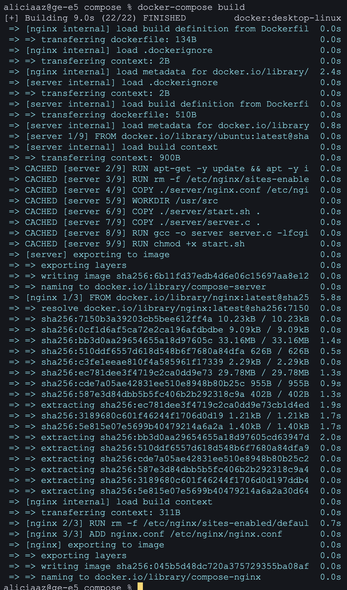

- 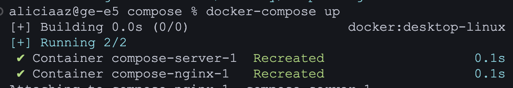

##### Проверь, что в браузере по *localhost:80* отдается написанная тобой страничка, как и ранее.

- 
