## Part 1. Использование готового манифеста

### Задание

1. Запустить окружение Kubernetes с памятью 4 GB.

- 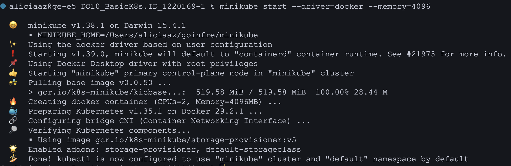

2. Применить манифест из директории `/src/example` к созданному окружению Kubernetes.

- 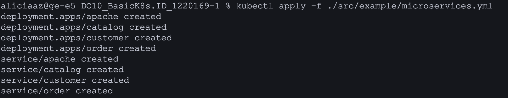

- 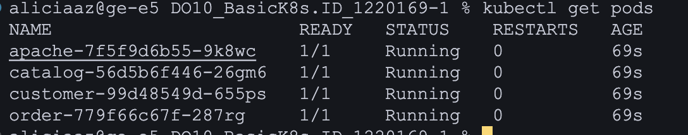

3. Запустить стандартную панель управления Kubernetes с помощью команды `minikube dashboard`.

- 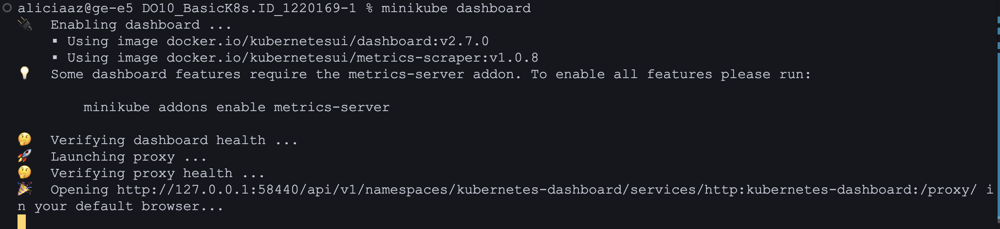

- 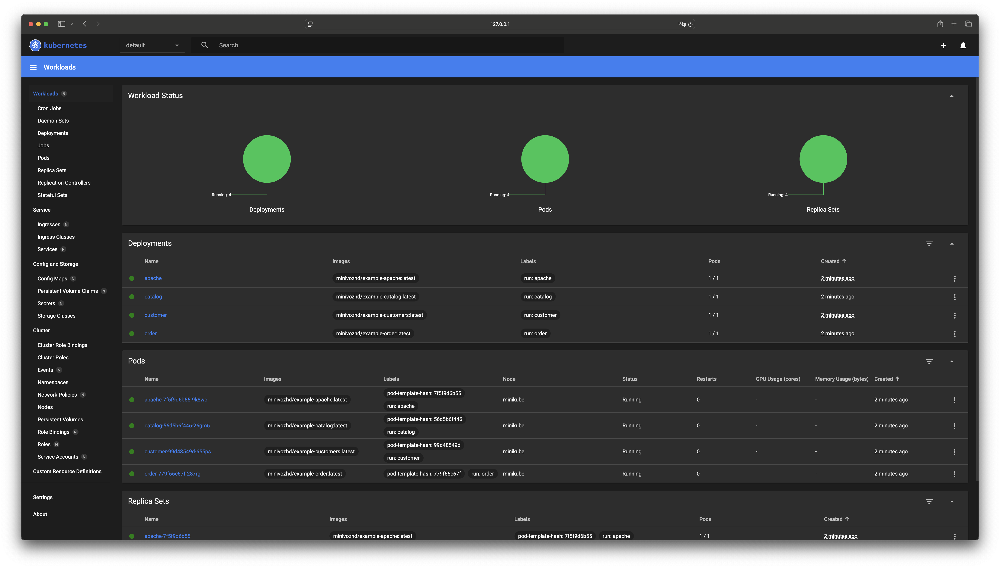

4. Прокинуть туннели для доступа к развернутым сервисам с помощью команды `minikube service`.

- 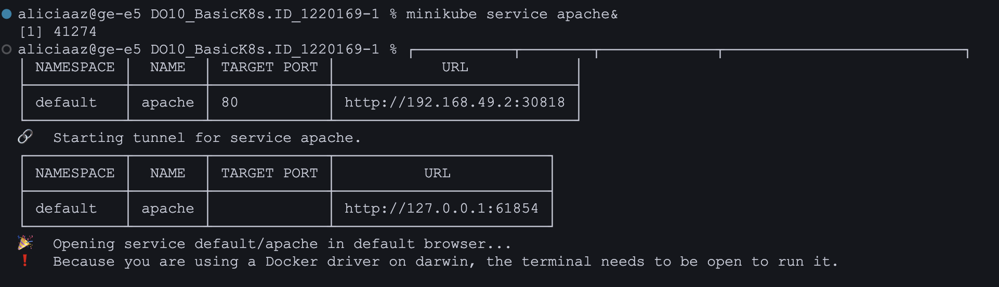


5. Удостовериться в работоспособности развернутого приложения, открыв в браузере страницу приложения (сервис apache).

- 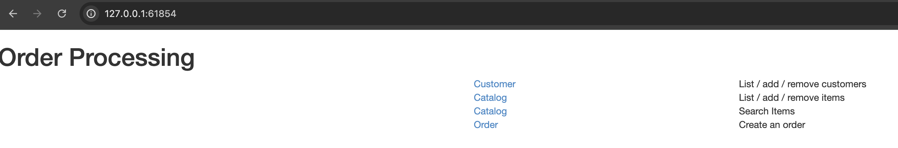

- 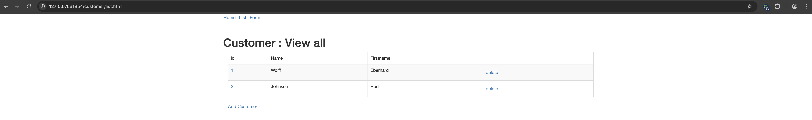

## Part 2. Написание собственного манифеста

### Задание

1. Написать собственные yml-файлы манифестов для приложения из первого проекта (`/src/services`), реализующие следующее:
   - карту конфигурации со значениями хостов БД и сервисов,

        <details>
        <summary>configmap.yaml</summary>
        
        ```yaml
        apiVersion: v1
        kind: ConfigMap
        metadata:
            name: app-config
            namespace: service
        data:
            POSTGRES_HOST: "postgres"
            POSTGRES_PORT: "5432"
            RABBIT_MQ_HOST: "rabbitmq"
            RABBIT_MQ_PORT: "5672"
            RABBIT_MQ_QUEUE_NAME: "messagequeue"
            RABBIT_MQ_EXCHANGE: "messagequeue-exchange"
            SESSION_SERVICE_HOST: "session-service"
            SESSION_SERVICE_PORT: "8081"
            HOTEL_SERVICE_HOST: "hotel-service"
            HOTEL_SERVICE_PORT: "8082"
            BOOKING_SERVICE_HOST: "booking-service"
            BOOKING_SERVICE_PORT: "8083"
            PAYMENT_SERVICE_HOST: "payment-service"
            PAYMENT_SERVICE_PORT: "8084"
            LOYALTY_SERVICE_HOST: "loyalty-service"
            LOYALTY_SERVICE_PORT: "8085"
            REPORT_SERVICE_HOST: "report-service"
            REPORT_SERVICE_PORT: "8086"
            GATEWAY_SERVICE_HOST: "gateway-service"
            GATEWAY_SERVICE_PORT: "8087"
        ```

        </details>

   - секреты с паролем и логином к БД и ключами межсервисной авторизации (их можно найти в файлах `application.properties`),

        <details>
        <summary>secrets.yaml</summary>
        
        ```yaml
        apiVersion: v1
        kind: Secret
        metadata:
            name: app-secrets
            namespace: service
        type: Opaque
        data:
            POSTGRES_USER: cG9zdGdyZXM=
            POSTGRES_PASSWORD: cG9zdGdyZXM=
            RABBIT_MQ_USER: Z3Vlc3Q=
            RABBIT_MQ_PASSWORD: Z3Vlc3Q=
            AUTH_TOKEN: TUlJRXZRSUJBREFOQmdrcWhraUc5dzBCQVFFRkFBU0NCS2N3Z2dTakFnRUFBb0lCQVFDOVExaGw2b3NzQ2c1VHI0M0lXMHB4Mld6MHRET0tSSG5jcmVaY2V3M0crNjNRdVhyTFNiNUJSaDI0cTBlajRXK1dqOC82UlI2dndHMWhGdFBJQnF5Nk9ZVXZFZEJtT2F5OWVFcHpRYzJYeTI1M3FTUXl4Y280Rm15TkxBd2Z5azBKUzVES2RhZ1Q2Y3QzQXFRZTkrb0dzRUhmMThDV0QvZG5ZcmZLSTY0NHVxbmlJM0x6cmsrWW5Jd1o4QkNoS01ONDBxZDdYa1J1V3NKQkdFSnIraHAxRjFLdmFZYlB6L2dxdkJKUytJbEczNy82bU8xeG9NYURmUHhFVUNKYkhpV1M4UGNTZUM5VGxsVlZ0QytveVBuUXpZRWJCaDdaZnhid0FEM3k1RlczcXhXTjMzc1E1M1hhSDd6SG9uZE1BUUo2aFFST0NiNk1sLzBiQktmVTBoejlBZ01CQUFFQ2dnRUFOSTU2QXJzeDhJWE9XckRhWjNQcVpWa2laNFdPOW10emg3T0d6OUdnRHN5ZkJPSXMxanpoSjFFb09icmVod1M0THhBNmlkNGQybUpPUFhMUVZyQjcwSzdlYkNhL1AxUHV3eUtmVWdoSTVra29vUFFJU0UwaWpaYTBpRE5lSG9uWUFLZktTbDZIMFJmUVYza1ZTRUJCN1orT2UzRjNXblNPbUZnU2Y0Q1BCZE5jMjQwa2FuUWx4c21LanNEbXN4TGVQaVlOeFU2dkRvWnQvSktRbVN3UVVJZ3puTW03dXBFbWgzVVI4cTdONzU3SStkVEVoR3hzOExMR3l2SjJuR25vbEg5ZnBrWEpsQUtIQVV2blgxTmZVa0NnSUdpVnFwc3h3SGI1alRtanFwSDFVOHVzYVNQWkREMHVMZjRETFVqSWdkZHBTR2NVSWpLbGFOTzlzUVhzQlFLQmdRRDVYcE5NcWdJWmd0ZkVPVko0NGF1TVpxQ3NJdUtYd3NJQ05abWVxU2t2NUoyOW92M1YvZmtCakRwd2l5RVhPLzlIZUZPVUVHU05HZUZQRjRoYTBLbk5GbWVUd0RDSVBBMnZ5RjNaMDQ5R2ZSeXRjNHFEcXdkcGxWamdQQlBLZnJHTm1HZEhsS0tvRUhHanBXbnVKZ09rTmhlblBLRzd6YmV2cHR5N1RxZ2x1d0tCZ1FEQ1M2SkVsOWozNGdwNStNb3hJYmtYdDFXT3duZ25Gd1JzY2tsVEVHSjR3WjNpNkd0S0lPVnpZZDdWRHFnb21CL2pua0RRbEJLNDdPekFBNTRiSkJrSjZ3ODNjREdSOEQ1MWF4WUtnS0crS2Q4RU9lRU40UFkrampLeVVwS1UzbzhvKytKS0VLczhKMnJhZW1iKzVZbGdpWTFaZUROaEw0THJVVmEzY0l5QXB3S0JnR1hvNTZ1NkFyZW9TRU54NWFsdkdHdDllWVkvajNqVDUvTjlNaldzRGgvN2Z4ZUQ1OWF2UHpjSnRzeE5uNDFlUUpwVnExcGtSS09CZ3htT2xYUC91SlVPNWU5MDZLQ1VZa2VIVEF0OE1SNXVmT3pKdmo3SEEzVjd5bUdCUzlsQ1k0OXBURFB0bzNlcG1MZDNIMDVyREt2c1MwaFdPQWFITU4xQkJRNHJPLzZIQW9HQU1RSkkvUXBjWlRKME9BNEVXbDVLUk93dXZhTGFFZW9oYUlWdmIyOWJsMkFuUmp3Z0RBTytQTnQ4REx2MHVNQ2VrcGl4ZXF0UENheGhqNUdhQ1BpVEJFaHhmeWRpcVpBekFRVXcreGMxTlRWMGxxbE8xbVJmV0tvZnFaRmdmZ0toazlIdFk0ZE8yZzZMU203RG1ob21DOTdHYzhINUc5T1RMMjVGOUdHRVgxTUNnWUVBNUNrcUF2bEpmeUNtNWxHcDJnTE1md0VsRjFvWXRnQzV4UkRwekk2RG5NaktoVXhlSmFNZ1JrYW0zbXZNQTB6ZzU4WlRZOXErQ2VTU3lEb2hOWnBMRFpvbUc3bUV1TkRXQVBicGFmbzlnOHExZzd1Y1dHZUZSZ1ZBbWYweG1uSkhIbUFxT0RkVDlYMDJhYkpaTXVtYXdDUkR0UnBQS3ZOdGFtTzlqZXg5WWdNPQ==
        ```

        </details>

   - поды и сервисы для всех модулей приложения: postgres, rabbitmq и 7 сервисов приложения. Для всех сервисов нужно использовать единственную реплику.

        <details>
        <summary>Пример манифеста на сервис (payment.yaml)</summary>
        
        ```yaml
        apiVersion: apps/v1
        kind: Deployment
        metadata:
          namespace: service
          name: payment-service
        spec:
          replicas: 1
          selector:
            matchLabels:
              app: payment-service
          template:
            metadata:
              labels:
                app: payment-service
            spec:
              containers:
              - name: payment-service
                image: xedll/payment-service:latest
                ports:
                - containerPort: 8084
                env:
                - name: POSTGRES_HOST
                  valueFrom:
                    configMapKeyRef:
                      name: app-config
                      key: POSTGRES_HOST
                - name: POSTGRES_PORT
                  valueFrom:
                    configMapKeyRef:
                      name: app-config
                      key: POSTGRES_PORT
                - name: POSTGRES_USER
                  valueFrom:
                    secretKeyRef:
                      name: app-secrets
                      key: POSTGRES_USER
                - name: POSTGRES_PASSWORD
                  valueFrom:
                    secretKeyRef:
                      name: app-secrets
                      key: POSTGRES_PASSWORD
                - name: POSTGRES_DB
                  value: "payments_db"
                - name: AUTH_TOKEN
                  valueFrom:
                    secretKeyRef:
                      name: app-secrets
                      key: AUTH_TOKEN
        ---
        apiVersion: v1
        kind: Service
        metadata:
          namespace: service

          name: payment-service
        spec:
          selector:
            app: payment-service
          ports:
          - port: 8084
            targetPort: 8084
        ```

        </details>


2. Запустить приложение путем последовательного применения манифестов командой `kubectl apply -f <манифест>.yaml`.

- 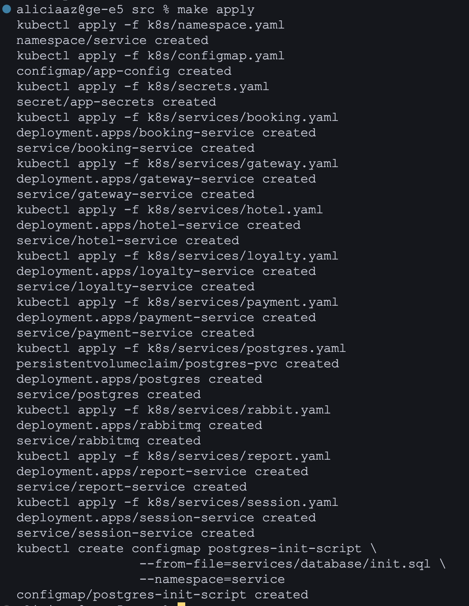

3. Проверить статус созданных объектов (секреты, конфигурационная карта, поды и сервисы) в кластере с помощью команд `kubectl get <тип_объекта> <имя_объекта>` и `kubectl describe <тип_объекта> <имя_объекта>`. Результат отобразить в отчете.

- 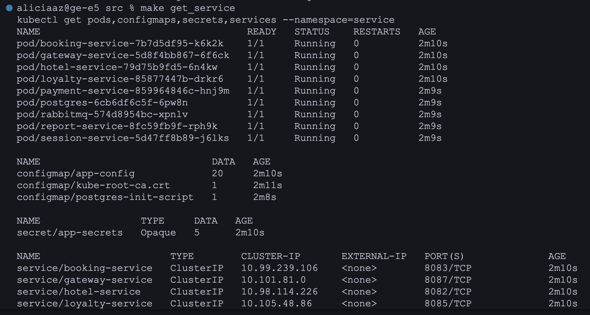

- 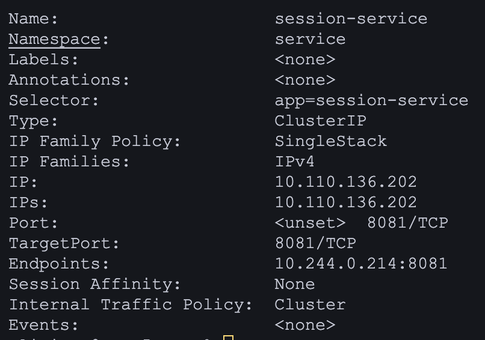
    Полный вывод команды describe есть в src/static/Part2/describe_output.txt

4. Проверить наличие правильных значений секретов, применив, например, команду `kubectl get secret my-secret -o jsonpath='{.data.password}' | base64 --decode` для декодирования секрета.

- 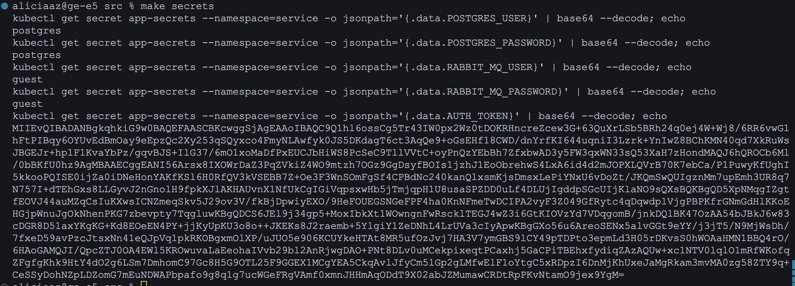

5. Проверить логи приложения, запущенного в кластере, командой `kubectl logs <имя_контейнера>`. Скриншот отобразить в отчете.

- 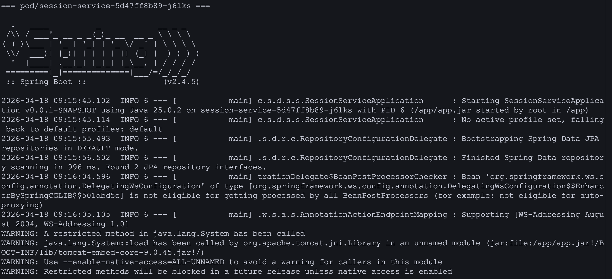
    Представлена лишь часть логов в связи с их массивным выводом

6. Прокинуть туннели для доступа к gateway service и session service.

- 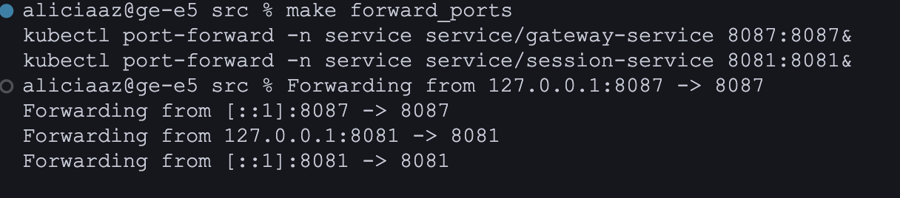

7. Запустить функциональные тесты Postman и удостовериться в работоспособности приложения.

- 

8. Запустить стандартную панель управления Kubernetes с помощью команды `minikube dashboard`. Отобразить в отчете следующую информацию в виде скриншотов с дашборда: текущее состояние узлов кластера, список запущенных Pod, а также другие метрики, такие как загрузка ЦП и память, логи Pod, конфигурации и секреты.

- 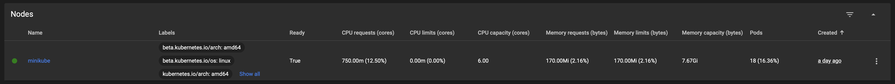

- 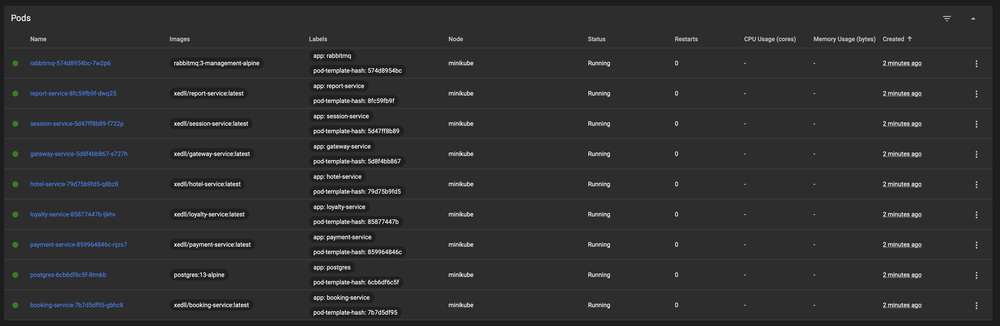

- 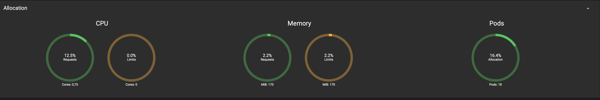

- 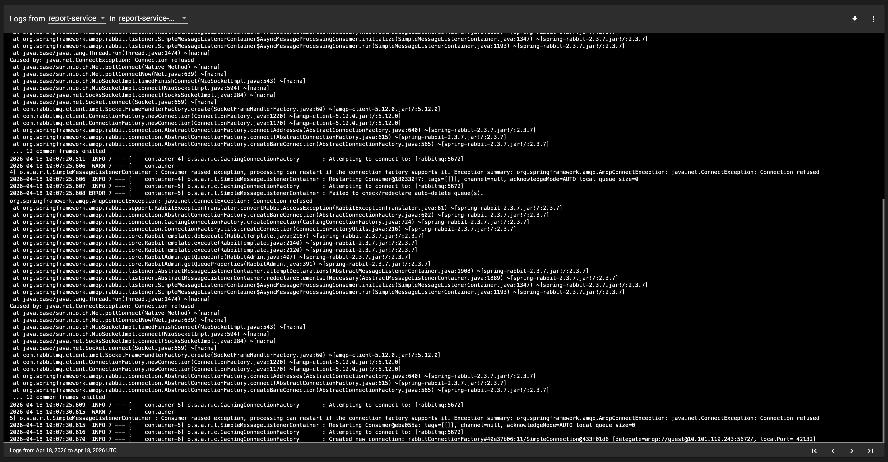

- 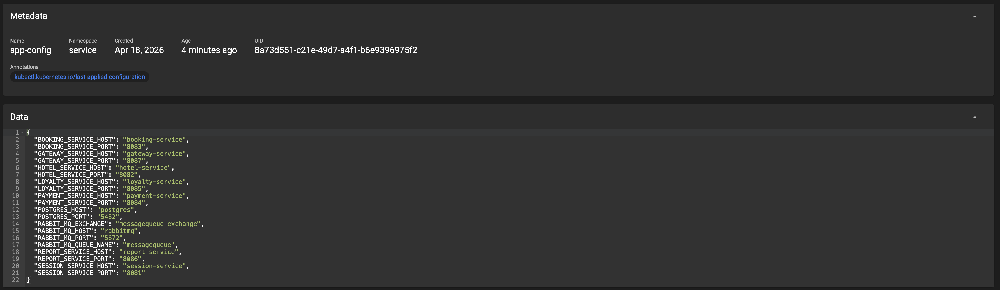

- 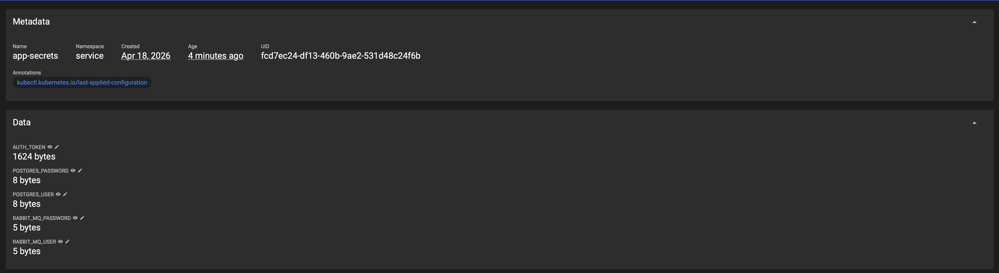

9. Обновить приложение (добавив новую зависимость в pom-файл) и пересобрать его со следующими стратегиями развертывания (замерить время переразвертывания приложения для каждого случая и отметить результаты в отчете):
   - пересоздание (recreate),
   - последовательное обновление (rolling).

- 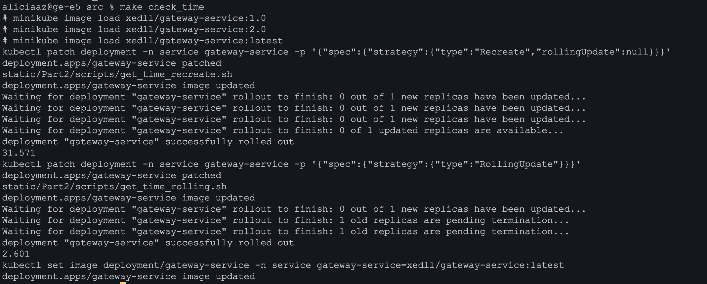