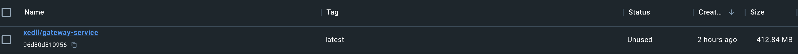
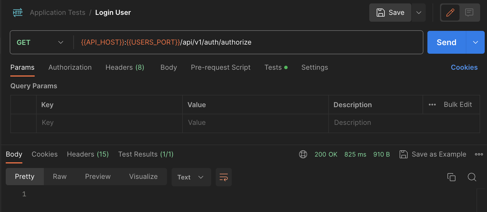
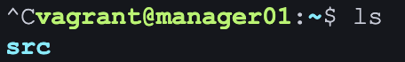
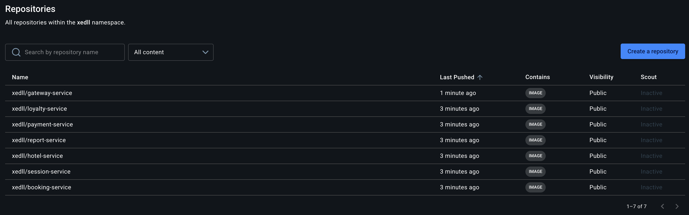
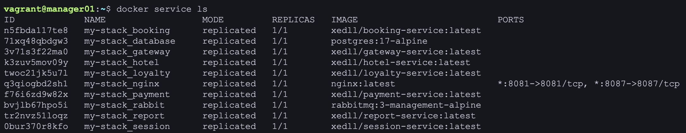
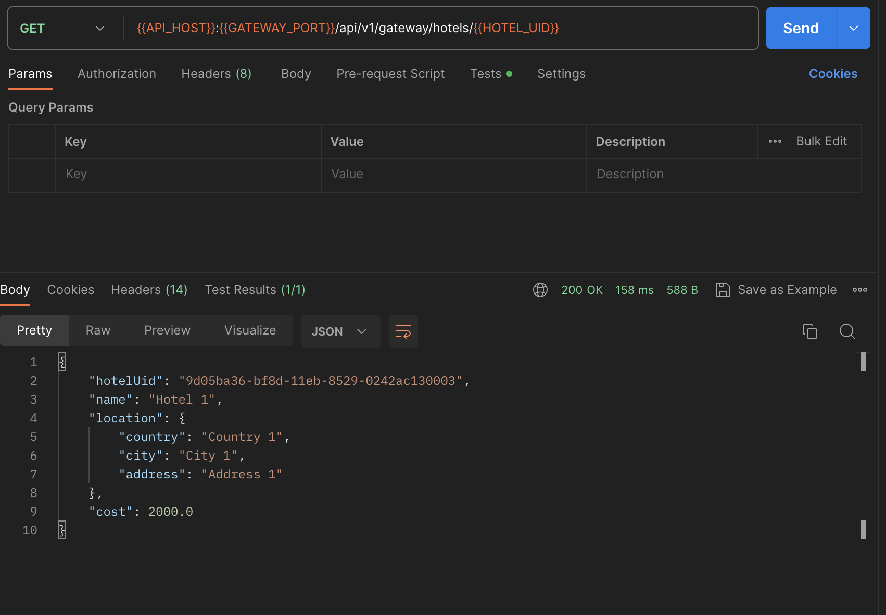
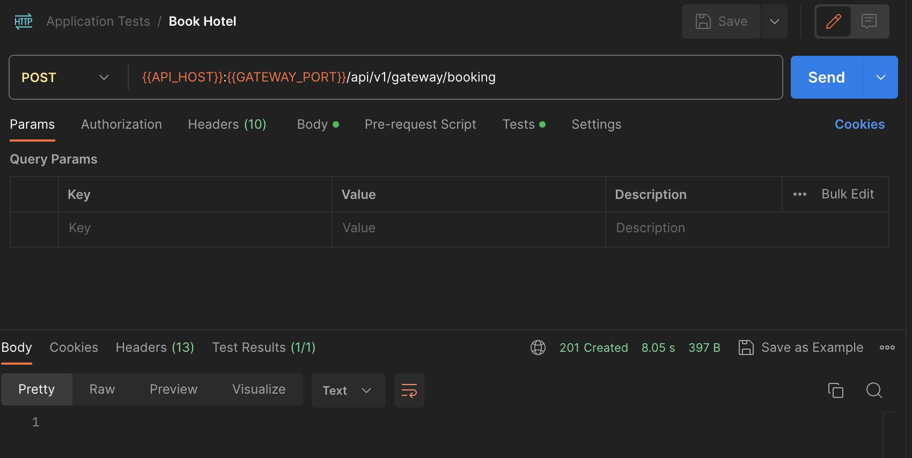
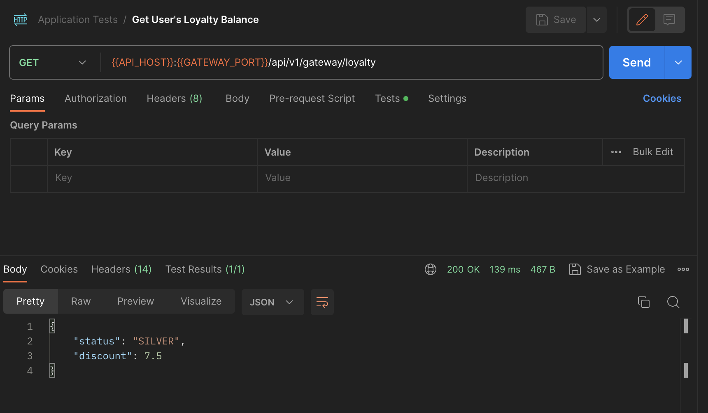
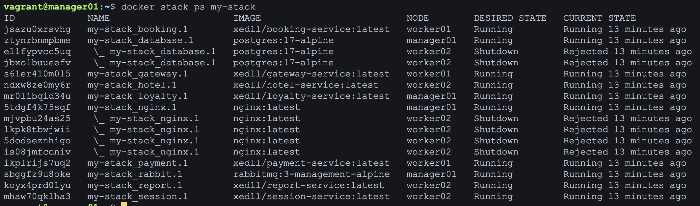
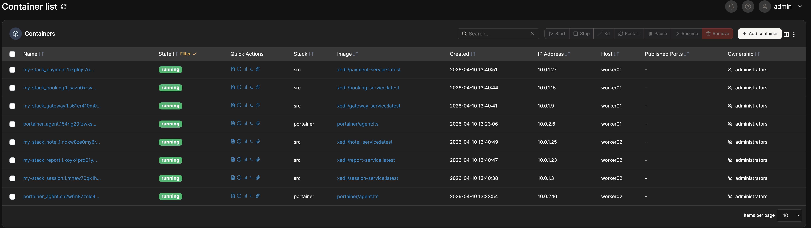

## Part 1. Запуск нескольких Docker-контейнеров с использованием Docker Compose

### Задание

1) Напиши Dockerfile для каждого отдельного микросервиса. Необходимые зависимости описаны в материалах. В отчете отобрази размер собранных образов любого сервиса различными способами.

- 

2) Напиши Docker Compose файл, который осуществляет корректное взаимодействие сервисов. Пробрось порты для доступа к gateway service и session service из локальной машины. Помощь по Docker Compose ты найдешь в материалах.

```
services:
  booking:
    build: services/booking-service/
    environment:
      HOTEL_SERVICE_HOST: 100.10.12.5
      HOTEL_SERVICE_PORT: 8082
      PAYMENT_SERVICE_HOST: 100.10.12.8
      PAYMENT_SERVICE_PORT: 8084
      LOYALTY_SERVICE_HOST: 100.10.12.6
      LOYALTY_SERVICE_PORT: 8085
      POSTGRES_DB: reservations_db
      POSTGRES_HOST: 100.10.12.7
      POSTGRES_PORT: 5432
      POSTGRES_USER: postgres 
      POSTGRES_PASSWORD: "password" 
      RABBIT_MQ_HOST: 100.10.12.17
      RABBIT_MQ_PORT: 5672
      RABBIT_MQ_USER: guest
      RABBIT_MQ_PASSWORD: guest
      RABBIT_MQ_QUEUE_NAME: messagequeue
      RABBIT_MQ_EXCHANGE: messagequeue-exchange
    depends_on:
      hotel:
        condition: service_started
      payment:
        condition: service_started
      loyalty:
        condition: service_started
      database:
        condition: service_healthy
      rabbit:
        condition: service_started
    expose:
      - "8083"
    networks:
      main:
        ipv4_address: 100.10.12.4

  gateway:
    build: services/gateway-service/
    ports: 
      - "8087:8087"
    expose:
      - "8087"
    environment:
      SESSION_SERVICE_HOST: 100.10.12.10
      SESSION_SERVICE_PORT: 8081
      HOTEL_SERVICE_HOST: 100.10.12.5
      HOTEL_SERVICE_PORT: 8082
      BOOKING_SERVICE_HOST: 100.10.12.4
      BOOKING_SERVICE_PORT: 8083
      LOYALTY_SERVICE_HOST: 100.10.12.6
      LOYALTY_SERVICE_PORT: 8085
      PAYMENT_SERVICE_HOST: 100.10.12.8
      PAYMENT_SERVICE_PORT: 8084
      REPORT_SERVICE_HOST: 100.10.12.9
      REPORT_SERVICE_PORT: 8086
    depends_on:
      session:
        condition: service_started
      hotel:
        condition: service_started
      booking:
        condition: service_started
      loyalty:
        condition: service_started
      payment:
        condition: service_started
      report:
        condition: service_started
    networks:
      main:
        ipv4_address: 100.10.12.3

  hotel:
    build: services/hotel-service/
    depends_on:
      database:
        condition: service_healthy
    expose:
      - "8082"
    environment:
      POSTGRES_HOST: 100.10.12.7
      POSTGRES_PORT: 5432
      POSTGRES_DB: hotels_db
      POSTGRES_USER: postgres
    networks:
      main:
        ipv4_address: 100.10.12.5

  loyalty:
    build: services/loyalty-service/
    depends_on:
      database:
        condition: service_healthy
    expose:
      - "8085"
    environment:
      POSTGRES_HOST: 100.10.12.7
      POSTGRES_PORT: 5432
      POSTGRES_DB: balances_db
      POSTGRES_USER: postgres
    networks:
      main:
        ipv4_address: 100.10.12.6

  database:
    image: postgres:17-alpine
    restart: always
    volumes:
      - ./services/database/init.sql:/docker-entrypoint-initdb.d/init.sql
    environment:
      POSTGRES_DB: aliciaaz
      POSTGRES_USER: postgres
      POSTGRES_PASSWORD: password
      POSTGRES_HOST_AUTH_METHOD: trust 
    expose:
      - "5432"
    healthcheck:
      test: ["CMD-SHELL", "pg_isready -U postgres -d aliciaaz"]
      interval: 5s
      timeout: 5s
      retries: 5
    networks:
      main:
        ipv4_address: 100.10.12.7

  payment:
    build: services/payment-service/
    depends_on:
      database:
        condition: service_healthy
    expose:
      - "8084"
    environment:
      POSTGRES_HOST: 100.10.12.7
      POSTGRES_PORT: 5432
      POSTGRES_DB: payments_db
      POSTGRES_USER: postgres
    networks:
      main:
        ipv4_address: 100.10.12.8

  report:
    build: services/report-service/
    depends_on:
      database:
        condition: service_healthy
      rabbit:
        condition: service_started
    expose:
      - "8086"
    networks:
      main:
        ipv4_address: 100.10.12.9
    environment:
      POSTGRES_HOST: 100.10.12.7
      POSTGRES_PORT: 5432
      POSTGRES_USER: postgres
      POSTGRES_DB: statistics_db
      RABBIT_MQ_HOST: 100.10.12.17
      RABBIT_MQ_PORT: 5672
      RABBIT_MQ_USER: guest
      RABBIT_MQ_PASSWORD: guest
      RABBIT_MQ_QUEUE_NAME: messagequeue
      RABBIT_MQ_EXCHANGE: messagequeue-exchange

  session:
    build: services/session-service/
    depends_on:
      database:
        condition: service_healthy
    expose:
      - "8081"
    ports: 
      - "8081:8081"
    networks:
      main:
        ipv4_address: 100.10.12.10
    environment:
      POSTGRES_HOST: 100.10.12.7
      POSTGRES_PORT: 5432
      POSTGRES_DB: users_db
      POSTGRES_USER: postgres

  rabbit:
    image: rabbitmq:3-management-alpine
    restart: always
    environment:
      RABBITMQ_DEFAULT_USER: guest
      RABBITMQ_DEFAULT_PASS: guest
    expose:
      - "5672"
    networks:
      main:
        ipv4_address: 100.10.12.17

networks:
  main:
    driver: bridge
    ipam:
      config:
        - subnet: 100.10.12.0/24
```

- Файл docker-compose-static.yml имеется в репозитории (./src/docker-compose-static.yml)


3) Собери и разверни веб-сервис с помощью написанного Docker Compose файла на локальной машине.

4) Прогони заготовленные тесты через postman и удостоверься, что все они проходят успешно. Инструкцию по запуску тестов можно найти в материалах. В отчете отобрази результаты тестирования.

- 

- 

- 

- 

- 

## Part 2. Создание виртуальных машин

### Задание 

1) Установи и инициализируй Vagrant в корне проекта. Напиши Vagrantfile для одной виртуальной машины. Перенеси исходный код веб-сервиса в рабочую директорию виртуальной машины. Помощь по vagrant ты найдешь в материалах.

```
Vagrant.configure("2") do |config|
  config.vm.box = "ubuntu/jammy64"
  config.vm.provider "virtualbox" do |vb|
        vb.name = "manager01"
        vb.cpus = 1
        vb.memory = 2048
  end
    config.vm.synced_folder "./src", "/home/vagrant/src"
end 
```

- Файл Vagrantfile1 имеется в репозитории (./Vagrantfile1)

2) Зайди через консоль внутрь виртуальной машины и удостоверься, что исходный код встал, куда нужно. Останови и уничтожь виртуальную машину.

- 

- 

## Part 3. Создание простейшего Docker Swarm

### Задание

1) Модифицируй Vagrantfile для создания трех машин: manager01, worker01, worker02. Напиши shell-скрипты для установки Docker внутрь машин, инициализации и подключения к Docker Swarm. Помощь с Docker Swarm ты найдешь в материалах.

```
Vagrant.configure("2") do |config|
    config.vm.box = "ubuntu/jammy64"
    config.vm.provider "virtualbox" do |vb|
      vb.memory = "4096"
      vb.cpus = 2
    end
  
    config.vm.define "manager01" do |manager|
      manager.vm.hostname = "manager01"

      manager.vm.network "private_network", ip: "192.168.56.11"
      manager.vm.network "forwarded_port", guest: 9443, host: 9443, host_ip: "127.0.0.1", id: "portainer_api_9443"
      manager.vm.network "forwarded_port", guest: 8087, host: 8087, host_ip: "127.0.0.1", id: "nginx_api_8087"
      manager.vm.network "forwarded_port", guest: 8081, host: 8081, host_ip: "127.0.0.1", id: "nginx_api_8081"

      manager.vm.synced_folder "./src", "/home/vagrant/src"
  
      manager.vm.provision "shell", path: "./src/scripts/install_docker.sh", name: "install_docker_manager"
      manager.vm.provision "shell", path: "./src/scripts/init_swarm_manager.sh", args: ["192.168.56.11"], name: "init_swarm_manager"
      manager.vm.provision "shell", inline: "docker stack deploy -c src/docker-compose.yml my-stack", name: "deploy_stack"
    end
  
    config.vm.define "worker01" do |worker|
      worker.vm.hostname = "worker01"
      worker.vm.network "private_network", ip: "192.168.56.12"
  
      worker.vm.synced_folder "./src/scripts", "/home/vagrant/scripts"
      worker.vm.provision "shell", path: "./src/scripts/install_docker.sh", name: "install_docker_worker1"
      worker.vm.provision "shell", path: "./src/scripts/join_swarm_worker.sh", name: "join_swarm_worker1"
    end
  
    config.vm.define "worker02" do |worker|
      worker.vm.hostname = "worker02"
      worker.vm.network "private_network", ip: "192.168.56.13"
  
      worker.vm.synced_folder "./src/scripts", "/home/vagrant/scripts"
      worker.vm.provision "shell", path: "./src/scripts/install_docker.sh", name: "install_docker_worker2"
      worker.vm.provision "shell", path: "./src/scripts/join_swarm_worker.sh", name: "join_swarm_worker2"
    end
  end
```

- Файл Vagrantfile имеется в репозитории (./Vagrantfile)

2) Загрузи собранные образы на Docker Hub и модифицируй Docker Compose файл для подгрузки расположенных на Docker Hub образов.

```
version: '3.8'

services:
  database:
    image: postgres:17-alpine
    hostname: mystackdatabase
    volumes:
      - ./services/database/init.sql:/docker-entrypoint-initdb.d/init.sql
    environment:
      POSTGRES_DB: aliciaaz
      POSTGRES_USER: postgres
      POSTGRES_PASSWORD: password
      POSTGRES_HOST_AUTH_METHOD: trust
    healthcheck:
      test: ["CMD-SHELL", "pg_isready -U postgres -d aliciaaz"]
      interval: 5s
      timeout: 5s
      retries: 5
      start_period: 10s
    networks:
      - main

  rabbit:
    image: rabbitmq:3-management-alpine
    hostname: mystackrabbit
    
    environment:
      RABBITMQ_DEFAULT_USER: guest
      RABBITMQ_DEFAULT_PASS: guest
    healthcheck:
      test: ["CMD", "rabbitmqctl", "status"]
      interval: 10s
      timeout: 5s
      retries: 5
      start_period: 30s
    networks:
      - main

  hotel:
    image: xedll/hotel-service
    hostname: mystackhotel

    depends_on:
      - database
    environment:
      WAIT_FOR_HOSTS: mystackdatabase:5432
      POSTGRES_HOST: mystackdatabase
      POSTGRES_PORT: 5432
      POSTGRES_DB: hotels_db
      POSTGRES_USER: postgres
    networks:
      - main

  loyalty:
    image: xedll/loyalty-service
    hostname: mystackloyalty
    depends_on:
      - database
    environment:
      WAIT_FOR_HOSTS: mystackdatabase:5432
      POSTGRES_HOST: mystackdatabase
      POSTGRES_PORT: 5432
      POSTGRES_DB: balances_db
      POSTGRES_USER: postgres
    networks:
      - main

  payment:
    image: xedll/payment-service
    hostname: mystackpayment
    depends_on:
      - database
    environment:
      WAIT_FOR_HOSTS: mystackdatabase:5432
      POSTGRES_HOST: mystackdatabase
      POSTGRES_PORT: 5432
      POSTGRES_DB: payments_db
      POSTGRES_USER: postgres
    networks:
      - main

  session:
    image: xedll/session-service
    hostname: mystacksession
    depends_on:
      - database
    environment:
      WAIT_FOR_HOSTS: mystackdatabase:5432
      POSTGRES_HOST: mystackdatabase
      POSTGRES_PORT: 5432
      POSTGRES_DB: users_db
      POSTGRES_USER: postgres
    networks:
      - main

  report:
    image: xedll/report-service
    hostname: mystackreport
    depends_on:
      - database
      - rabbit
    environment:
      WAIT_FOR_HOSTS: mystackdatabase:5432 mystackrabbit:5672
      POSTGRES_HOST: mystackdatabase
      POSTGRES_PORT: 5432
      POSTGRES_USER: postgres
      POSTGRES_DB: statistics_db
      RABBIT_MQ_HOST: mystackrabbit
      RABBIT_MQ_PORT: 5672
      RABBIT_MQ_USER: guest
      RABBIT_MQ_PASSWORD: guest
      RABBIT_MQ_QUEUE_NAME: messagequeue
      RABBIT_MQ_EXCHANGE: messagequeue-exchange
    networks:
      - main

  booking:
    image: xedll/booking-service
    hostname: mystackbooking
    depends_on:
      - hotel
      - payment
      - loyalty
      - database
      - rabbit
    environment:
      WAIT_FOR_HOSTS: mystackhotel:8082 mystackpayment:8084 mystackloyalty:8085 mystackdatabase:5432 mystackrabbit:5672
      HOTEL_SERVICE_HOST: mystackhotel
      HOTEL_SERVICE_PORT: 8082
      PAYMENT_SERVICE_HOST: mystackpayment
      PAYMENT_SERVICE_PORT: 8084
      LOYALTY_SERVICE_HOST: mystackloyalty
      LOYALTY_SERVICE_PORT: 8085
      POSTGRES_DB: reservations_db
      POSTGRES_HOST: mystackdatabase
      POSTGRES_PORT: 5432
      POSTGRES_USER: postgres
      POSTGRES_PASSWORD: "password"
      RABBIT_MQ_HOST: mystackrabbit
      RABBIT_MQ_PORT: 5672
      RABBIT_MQ_USER: guest
      RABBIT_MQ_PASSWORD: guest
      RABBIT_MQ_QUEUE_NAME: messagequeue
      RABBIT_MQ_EXCHANGE: messagequeue-exchange
    networks:
      - main

  gateway:
    image: xedll/gateway-service
    hostname: mystackgateway
    depends_on:
      - session
      - hotel
      - booking
      - loyalty
      - payment
      - report
    environment:
      WAIT_FOR_HOSTS: mystacksession:8081 mystackhotel:8082 mystackbooking:8083 mystackloyalty:8085 mystackpayment:8084 mystackreport:8086
      SESSION_SERVICE_HOST: mystacknginx
      SESSION_SERVICE_PORT: 8081
      HOTEL_SERVICE_HOST: mystackhotel
      HOTEL_SERVICE_PORT: 8082
      BOOKING_SERVICE_HOST: mystackbooking
      BOOKING_SERVICE_PORT: 8083
      LOYALTY_SERVICE_HOST: mystackloyalty
      LOYALTY_SERVICE_PORT: 8085
      PAYMENT_SERVICE_HOST: mystackpayment
      PAYMENT_SERVICE_PORT: 8084
      REPORT_SERVICE_HOST: mystackreport
      REPORT_SERVICE_PORT: 8086
    networks:
      - main

  nginx:
    image: nginx:latest
    hostname: mystacknginx
    
    volumes:
      - ./services/nginx/default.conf:/etc/nginx/conf.d/default.conf
    ports:
      - "8087:8087"
      - "8081:8081"
    networks:
      - main

networks:
  main:
    driver: overlay
```
- Файл docker-compose.yml имеется в репозитории (src/docker-compose.yml)

- 

3) Подними виртуальные машины и перенеси на менеджер Docker Compose файл. Запусти стек сервисов, используя написанный Docker Compose файл.

- 

4) Настрой прокси на базе nginx для доступа к gateway service и session service по оверлейной сети. Сами gateway service и session service сделай недоступными напрямую.

```
upstream gateway-service {
    server mystackgateway:8087;
}


server {
    listen 8087;

    location / {
        proxy_pass http://gateway-service;
        proxy_set_header Host "localhost:8087";
    }
}
upstream session-service {
    server mystacksession:8081;
}

server {
    listen 8081;

    location / {
        proxy_pass http://session-service;
        proxy_set_header Host "localhost:8081";
    }
}
```
- Файл nginx.conf имеется в репозитории (src/services/nginx/default.conf)

5) Прогони заготовленные тесты через Postman и удостоверься, что все они проходят успешно. В отчете отобрази результаты тестирования.

- 

- 

- 

- 

- 


6) Используя команды Docker, отобрази в отчете распределение контейнеров по узлам.

- 

7) Установи отдельным стеком Portainer внутри кластера. В отчете отобрази визуализацию распределения задач по узлам с помощью Portainer.

- 