## Part 1. Удаленное конфигурирование узла через Ansible

### Задание

1. Создать с помощью Vagrant три машины: manager, node01, node02. Не устанавливать с помощью shell-скриптов docker при создании машин на Vagrant! Прокинуть порты node01 на локальную машину для доступа к пока еще не развернутому микросервисному приложению.

<details>
<summary>Vagrant конфиг</summary>

```ruby
Vagrant.configure("2") do |config|
    config.vm.box = "ubuntu/jammy64"
    config.vm.provider "virtualbox" do |vb|
      vb.memory = "4096"
      vb.cpus = 2

      vb.customize ["modifyvm", :id, "--nictype1", "virtio"]
      vb.customize ["modifyvm", :id, "--nictype2", "virtio"]
    end
  
    config.vm.define "manager" do |manager|
      manager.vm.hostname = "manager"
      manager.vm.network "private_network", ip: "192.168.56.11"
    end
  
    config.vm.define "node01" do |node|
      node.vm.hostname = "node01"
      node.vm.network "private_network", ip: "192.168.56.12"
      node.vm.network "forwarded_port", guest: 8081, host: 8081, host_ip: "127.0.0.1", id: "nginx_api_8081"
      node.vm.network "forwarded_port", guest: 8087, host: 8087, host_ip: "127.0.0.1", id: "nginx_api_8087"
    end
  
    config.vm.define "node02" do |node|
      node.vm.hostname = "node02"
      node.vm.network "private_network", ip: "192.168.56.13"
    end
end
```
</details>

2. Подготовить manager как рабочую станцию для удаленного конфигурирования (помощь по Ansible в материалах).
   - Зайти на manager. 

        - 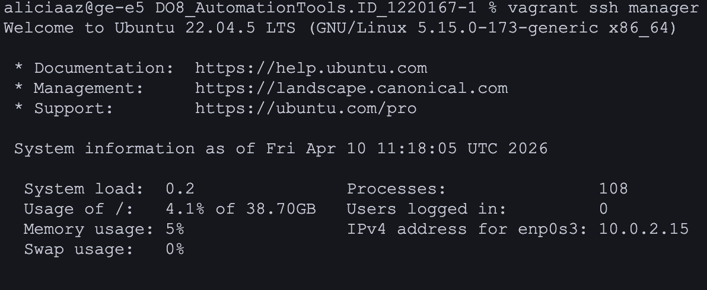

   - На manager проверить подключение к node01 через ssh по приватной сети. 

        - 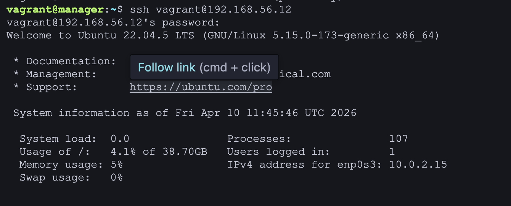

   - Сгенерировать ssh-ключ для подключения к node01 из manager (без passphrase). 

        - 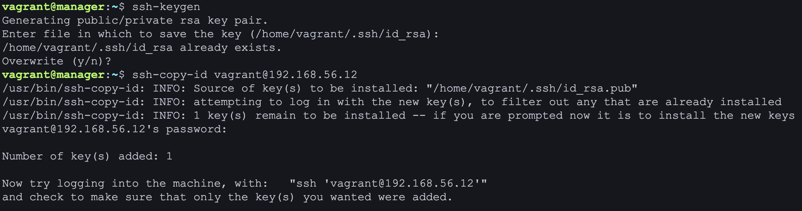

   - Скопировать на manager docker-compose файл и исходный код микросервисов. (Используй проект из папки src и docker-compose файл из предыдущей главы. Помощь по ssh в материалах.)
        
        - 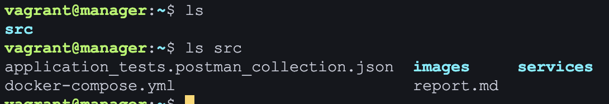

   - Установить Ansible на менеджер и создать папку ansible, в которой создать inventory-файл. 
   
        - 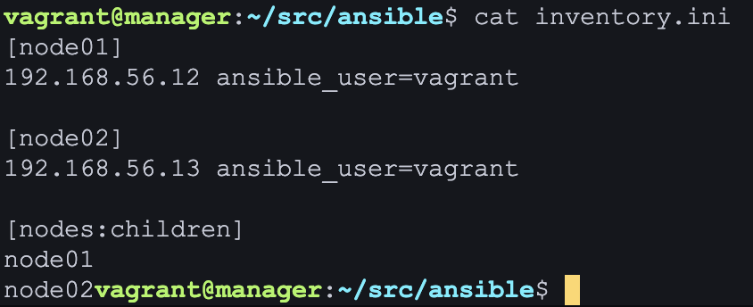
   
   - Использовать модуль ping для проверки подключения через Ansible. 
   
        - 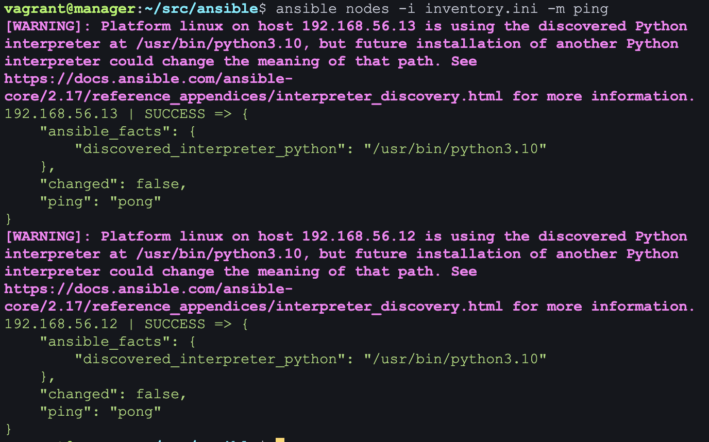
   
   - Результат выполнения модуля поместить в отчет.

3. Написать первый плейбук для Ansible, который выполняет apt update, устанавливает docker, docker-compose, копирует compose-файл из manager'а и разворачивает микросервисное приложение. 

<details>
<summary>Playbook</summary>

```
---
- name: Update and upgrade Ubuntu systems
  hosts: all
  become: yes
  gather_facts: yes
  
  tasks:
    - name: Update apt cache
      apt:
        update_cache: yes
        cache_valid_time: 3600

    - name: Install docker
      apt:
        name: docker.io
        state: latest

    - name: Install docker-compose
      apt:
        name: docker-compose
        state: latest

    - name: Copy docker-compose.yml to all nodes
      copy:
        src: /home/vagrant/src/docker-compose.yml
        dest: /home/vagrant/docker-compose.yml
        owner: vagrant
        group: vagrant
        mode: '0644'

    - name: Log in to Docker Hub
      docker_login:
        registry_url: https://index.docker.io/v1/
        username: "{{ docker_hub_username }}"
        password: "{{ docker_hub_password }}"
      no_log: true  
      
    - name: Start service
      docker_compose:
        project_src: /home/vagrant
        state: present
      register: compose_output
```

</details>


4. Прогнать заготовленные тесты через postman и удостовериться, что все они проходят успешно. В отчете отобразить результаты тестирования.

- 

- 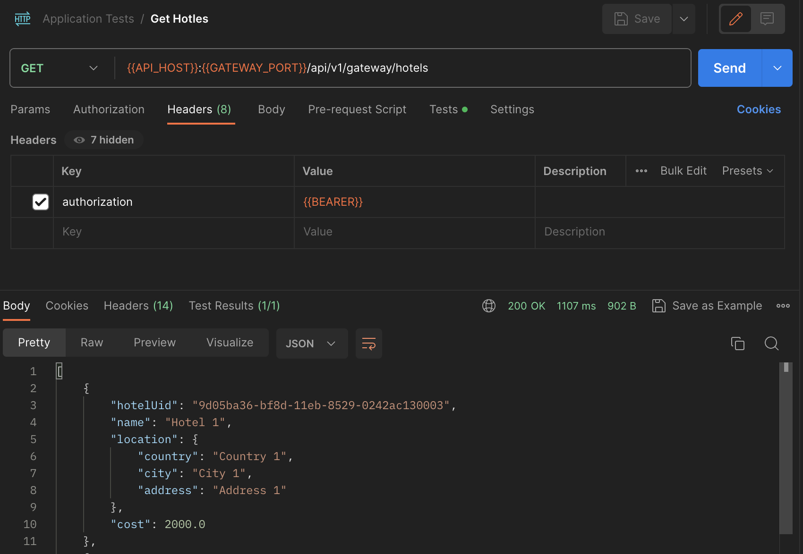

- 

- 

- 


5. Сформировать три роли: 
   - роль application выполняет развертывание микросервисного приложения при помощи docker-compose;
   - apache устанавливает и запускает стандартный apache сервер;
   - postgres устанавливает и запускает postgres, создает базу данных с произвольной таблицей и добавляет в нее три произвольные записи. 
   - Назначить первую роль node01 и вторые две роли node02, проверить postman-тестами работоспособность микросервисного приложения, удостовериться в доступности postgres и apache-сервера. Для Apache веб-страница должна открыться в браузере. Что касается PostgreSQL, необходимо подключиться с локальной машины и отобразить содержимое ранее созданной таблицы с данными.

    - 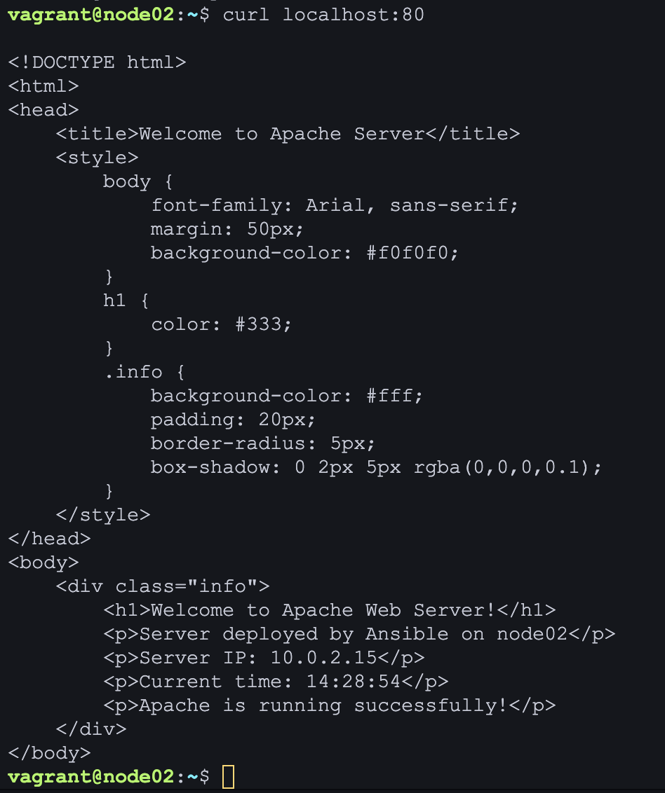

    - 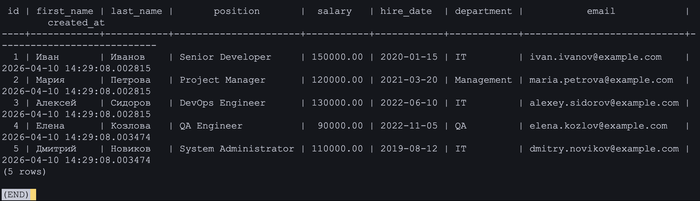

6. Созданные в этом разделе файлы разместить в папке `src\ansible01` в личном репозитории.

## Part 2. Service Discovery

Теперь перейдем к обнаружению сервисов. В этой главе тебе предстоит сымитировать два удаленных сервиса — api и БД, и осуществить между ними подключение через Service Discovery с использованием Consul.

### Задание

1. Написать два конфигурационных файла для consul (информация по consul в материалах):
   - consul_server.hcl:
      - настроить агент как сервер;
      - указать в advertise_addr интерфейс, направленный во внутреннюю сеть Vagrant;
   - consul_client.hcl:
      - настроить агент как клиент;
      - указать в advertise_addr интерфейс, направленный во внутреннюю сеть Vagrant.


<details>
<summary>consul_server.hcl</summary>

```hcl
server = true
ui = true

bootstrap_expect = 1

datacenter= "dc1"
data_dir = "/opt/consul"

bind_addr = "{{ consul_server_ip }}"
client_addr = "127.0.0.1"
advertise_addr = "{{ consul_server_ip }}"

```
</details>


<details>
<summary>consul_client.hcl</summary>

```hcl
server = false
data_dir = "/opt/consul"
datacenter= "dc1"

bind_addr = "{{ consul_client_ip }}"
advertise_addr = "{{ consul_client_ip }}"
client_addr = "127.0.0.1"

retry_join = ["192.168.56.11"]  
retry_interval = "30s"
retry_max = 0  

rejoin_after_leave = true

connect {
  enabled = true
}
ports {
    grpc = 8502
}
```
</details>

2. Создать с помощью Vagrant четыре машины: consul_server, api, manager и db.
   - Прокинуть порт 8082 с api на локальную машину для доступа к пока еще не развернутому api.
   - Прокинуть порт 8500 с consul_server для доступа к ui consul. 

<details>
<summary>Vagrant конфиг</summary>

```ruby
Vagrant.configure("2") do |config|
    config.vm.box = "ubuntu/jammy64"
    config.vm.provider "virtualbox" do |vb|
      vb.memory = "4096"
      vb.cpus = 2

      vb.customize ["modifyvm", :id, "--nictype1", "virtio"]
      vb.customize ["modifyvm", :id, "--nictype2", "virtio"]
    end

    config.vm.define "consul_server" do |consul_server|
      consul_server.vm.hostname = "consulServer"
      consul_server.vm.network "private_network", ip: "192.168.56.11"
      consul_server.vm.network "forwarded_port", guest: 8500, host: 8500, host_ip: "127.0.0.1", id: "nginx_api_8081"
    end
  
    config.vm.provision "shell", name: "allow_ssh_password", inline:"sudo sed -i 's/PasswordAuthentication no/PasswordAuthentication yes/' /etc/ssh/sshd_config.d/60-cloudimg-settings.conf; sudo systemctl restart sshd; echo \"vagrant:vagrant\" | sudo chpasswd"

    config.vm.define "api" do |node|
      node.vm.hostname = "api"
      node.vm.network "private_network", ip: "192.168.56.12"
      node.vm.network "forwarded_port", guest: 8082, host: 8082, host_ip: "127.0.0.1", id: "nginx_api_8081"
    end
  
    config.vm.define "consul_manager" do |node|
        node.vm.hostname = "consulManager"
        node.vm.network "private_network", ip: "192.168.56.13"
        node.vm.synced_folder "./src", "/home/vagrant/src"

        node.vm.provision "shell", name:"ansible_install", inline: <<-SHELL
        sudo apt update
        sudo apt install -y software-properties-common
        sudo add-apt-repository --yes --update ppa:ansible/ansible
        sudo apt install -y ansible sshpass      
        SHELL
    end
      config.vm.define "db" do |node|
        node.vm.hostname = "db"
        node.vm.network "private_network", ip: "192.168.56.14"
      end
end
```
</details>

3. Написать плейбук для ansible и четыре роли: 
   - install_consul_server, которая:
      - работает с consul_server;
      - копирует consul_server.hcl;
      - устанавливает consul и необходимые для consul зависимости;
      - запускает сервис consul;
   - install_consul_client, которая:
      - работает с api и db;
      - копирует consul_client.hcl;
      - устанавливает consul, envoy и необходимые для consul зависимости; 
      - запускает сервис consul и consul-envoy;
   - install_db, которая:
      - работает с db;
      - устанавливает postgres и запускает его;
      - создает базу данных `hotels_db`;
   - install_hotels_service, которая:
      - работает с api;
      - копирует исходный код сервиса;
      - устанавливает `openjdk-21-jdk`;
      - создает глобальные переменные окружения:
         - POSTGRES_HOST="127.0.0.1";
         - POSTGRES_PORT="5432";
         - POSTGRES_DB="hotels_db";
         - POSTGRES_USER="<имя пользователя>";
         - POSTGRES_PASSWORD="<пароль пользователя>";
      - запускает собранный jar-файл командой `java -jar <путь до hotel-service>/hotel-service/target/<имя jar-файла>.jar`.

4. Проверить работоспособность CRUD-операций над сервисом отелей. В отчете отобразить результаты тестирования.

```bash
UUID=$(cat /proc/sys/kernel/random/uuid)

curl -i -X POST http://127.0.0.1:8082/hotels \
  -H "Content-Type: application/json" \
  -d "{
        \"hotelUid\":\"$UUID\",
        \"rooms\":50,
        \"cost\":1500,
        \"name\":\"School21\",
        \"address\":\"Ramonagr\"
      }"

curl -s http://127.0.0.1:8082/hotels | grep -A3 School21 || true

curl -i -X PUT http://127.0.0.1:8082/hotels/1 \
  -H "Content-Type: application/json" \
  -d '{
        "hotelUid":"5ce46f1b-3c46-4227-b333-a35d6c9a00ac",
        "rooms":60,
        "cost":1700,
        "name":"School21 (updated)",
        "address":"Ramonagr, bld. 2"
      }'

curl -i -X DELETE http://127.0.0.1:8082/hotels/1
```

<details>
<summary>Результаты тестирования</summary>

- 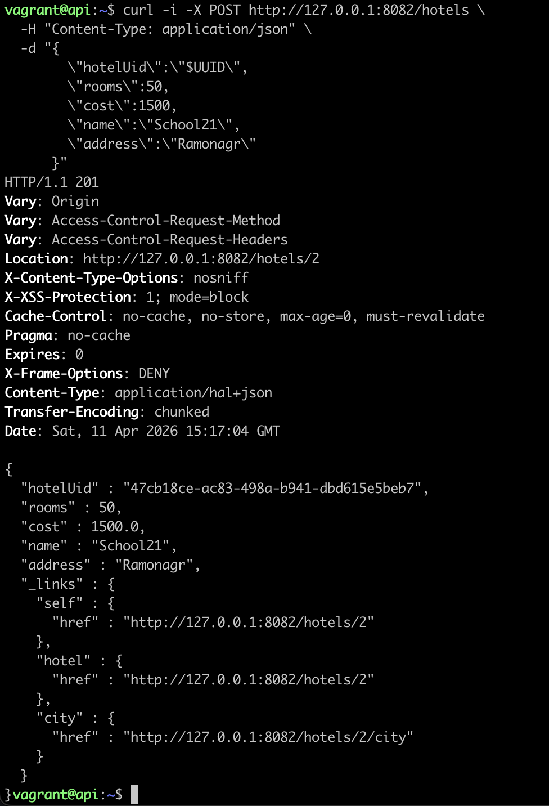

- 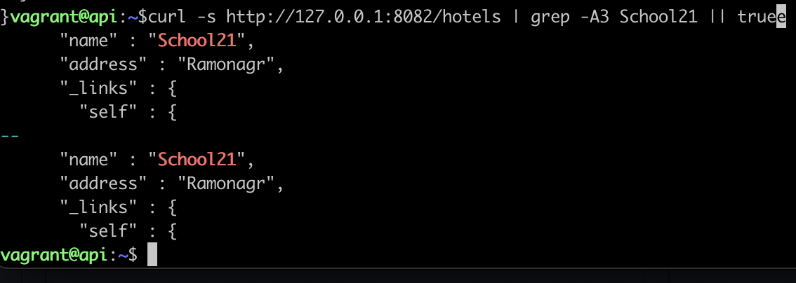

- 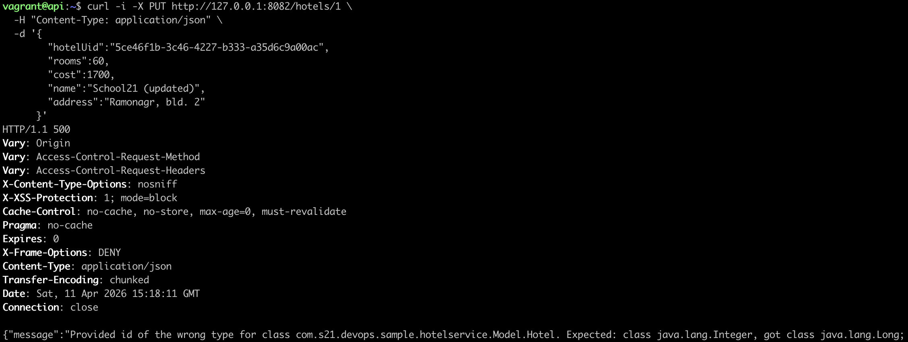

- 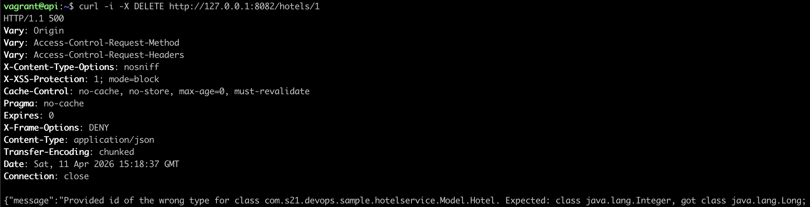

</details>

5. Созданные в этом разделе файлы разместить в папках `src\ansible02` и `src\consul01` в личном репозитории.