Задание
Получить набор виртуальных машин для кластера.

- Для виртуалок использовал Vagrantfile
    <details>
    <summary>Vagrantfile</summary>
    
    ```ruby
    Vagrant.configure("2") do |config|
        config.vm.box = "ubuntu/jammy64"
        config.vm.provider "virtualbox" do |vb|
            vb.memory = "4096"
            vb.cpus = 2
            vb.customize ["modifyvm", :id, "--nictype1", "82540EM"]
            vb.customize ["modifyvm", :id, "--nictype2", "82540EM"]
        end

        config.vm.provision "shell", inline: "apt update && apt upgrade -y", name: "update_upgrade"
        config.vm.provision "shell", inline: "sudo swapoff -a", name: "swap"
        config.vm.synced_folder "./src", "/home/vagrant/src"

        config.vm.define "manager01" do |manager|
            manager.vm.hostname = "manager01"
            manager.vm.network "private_network", ip: "192.168.56.11"
            
            manager.vm.network "forwarded_port", guest: 8087, host: 8087, host_ip: "127.0.0.1", id: "nginx_api_8087"
            manager.vm.network "forwarded_port", guest: 8081, host: 8081, host_ip: "127.0.0.1", id: "nginx_api_8081"

            manager.vm.provision "shell", inline: 'curl -sfL https://get.k3s.io | INSTALL_K3S_EXEC="--disable=traefik --node-ip=192.168.56.11 --flannel-backend=host-gw" sh - && cp /var/lib/rancher/k3s/server/node-token /home/vagrant/src/node-token', name: "install_manager"
            manager.vm.provision "shell", inline: 'sudo apt install nginx && cp /home/vagrant/src/services/nginx/default.conf /etc/nginx/conf.d/default.conf', name: "install_nginx"
        end

        config.vm.define "worker01" do |worker|
            worker.vm.hostname = "worker01"
            worker.vm.network "private_network", ip: "192.168.56.12"
            worker.vm.provision "shell", inline: 'sleep 10 && sudo curl -sfL https://get.k3s.io | K3S_URL=https://192.168.56.11:6443 INSTALL_K3S_EXEC="--node-ip=192.168.56.12" K3S_TOKEN=$(cat /home/vagrant/src/node-token) sh -', name: "join_worker"
        end

        config.vm.define "worker02" do |worker|
            worker.vm.hostname = "worker02"
            worker.vm.network "private_network", ip: "192.168.56.13"
            worker.vm.provision "shell", inline: 'sleep 10 && sudo curl -sfL https://get.k3s.io | K3S_URL=https://192.168.56.11:6443 INSTALL_K3S_EXEC="--node-ip=192.168.56.13" K3S_TOKEN=$(cat /home/vagrant/src/node-token) sh -', name: "join_worker"
        end
    end
    ```

    </details>

Установить k3s на всех трех машинах. При установке не использовать стандартный Ingress Controller при помощи флага --disable=traefik.

Выполнить подключение узлов к кластеру, используя команду k3s server и флаги --token и --server для рабочих узлов и мастера соответственно. Когда k3s установлен, можно использовать переменную окружения NODE_TOKEN.

- Установка и подключение происходят при создании машин с помощью вагранта:
    ```
    Для контроль-ноды: 
        manager.vm.provision "shell", inline: 'curl -sfL https://get.k3s.io | INSTALL_K3S_EXEC="--disable=traefik --node-ip=192.168.56.11 --flannel-backend=host-gw" sh - && cp /var/lib/rancher/k3s/server/node-token /home/vagrant/src/node-token', name: "install_manager"
    Для воркер-ноды:
        worker.vm.provision "shell", inline: 'sleep 10 && sudo curl -sfL https://get.k3s.io | K3S_URL=https://192.168.56.11:6443 INSTALL_K3S_EXEC="--node-ip=192.168.56.13" K3S_TOKEN=$(cat /home/vagrant/src/node-token) sh -', name: "join_worker"
    ```

Установить Ingress Controller Nginx вместо стандартного. Ты можешь использовать официальный файл манифеста Ingress контроллера на базе Nginx, доступный на GitHub.

- 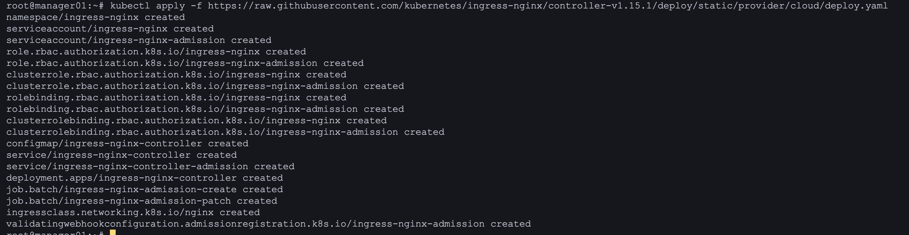

- 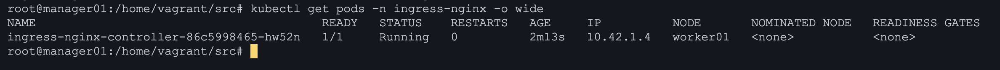

Получить доменное имя и сконфигурировать внутри кластера утилиту cert-manager, которая должна генерировать wildcard-сертификат для полученного домена.

- Из-за того что маршруты Flannel у меня идут через NAT интерфейс, пришлось изменить конфиг k3s сервиса на всех нодах, чтобы всё шло через внутреннюю сеть:

    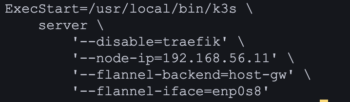

    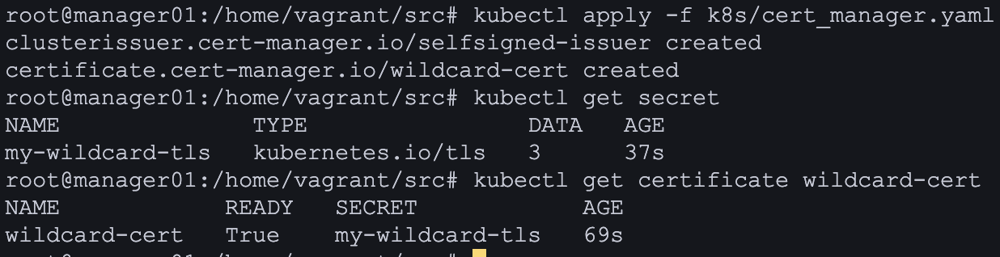

Создать ресурс Ingress для своего личного домена и настроить его для использования контроллера nginx ingress и полученного сертификата.

- 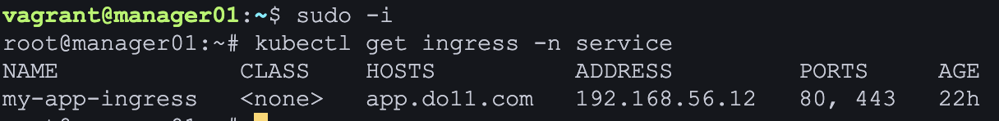
    
    Так же для распознавания домена в сети отредактировал /etc/hosts
- 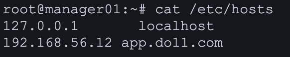

Создать PV (Persistent Volume) для базы данных PostgreSQL в манифесте из десятого проекта.

- 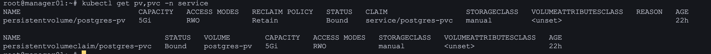

Запустить приложение, описанное в манифесте.

- 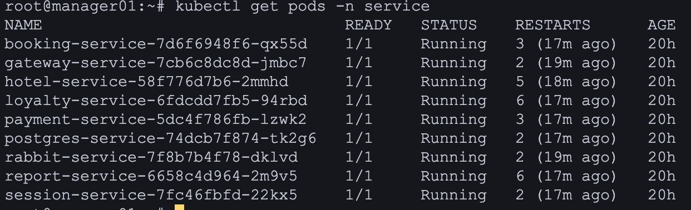

Запустить функциональные тесты Postman и удостовериться в работоспособности приложения.

- 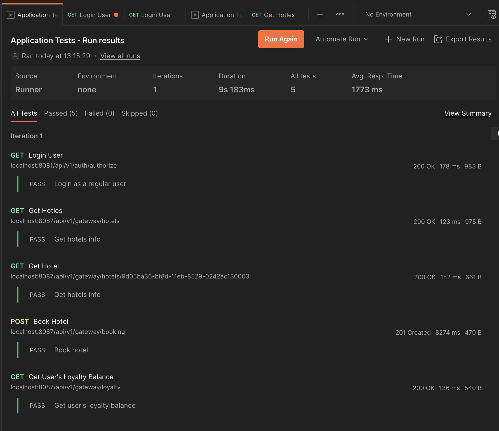
    Для доступа постмена в сеть кубера настроил прокси на manager01 на nginx для проксирования запросов с портов 8081 и 8087 на домен app.do11.com

Установить и запустить Prometheus Operator для сбора метрик в системе. Продемонстрировать в отчете результат выполнения команды kubectl get pods -n monitoring.

- 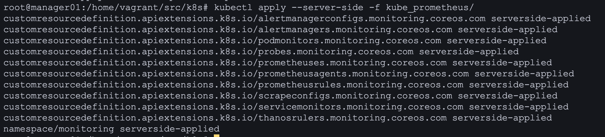

    Так же для выдачи метрик установил под с самим Prometheus'ом
- 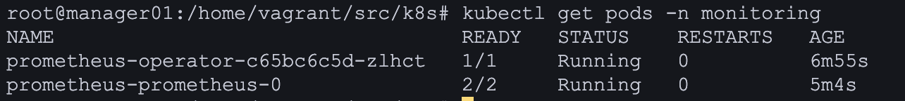

    Проверяем выдачу метрик
- 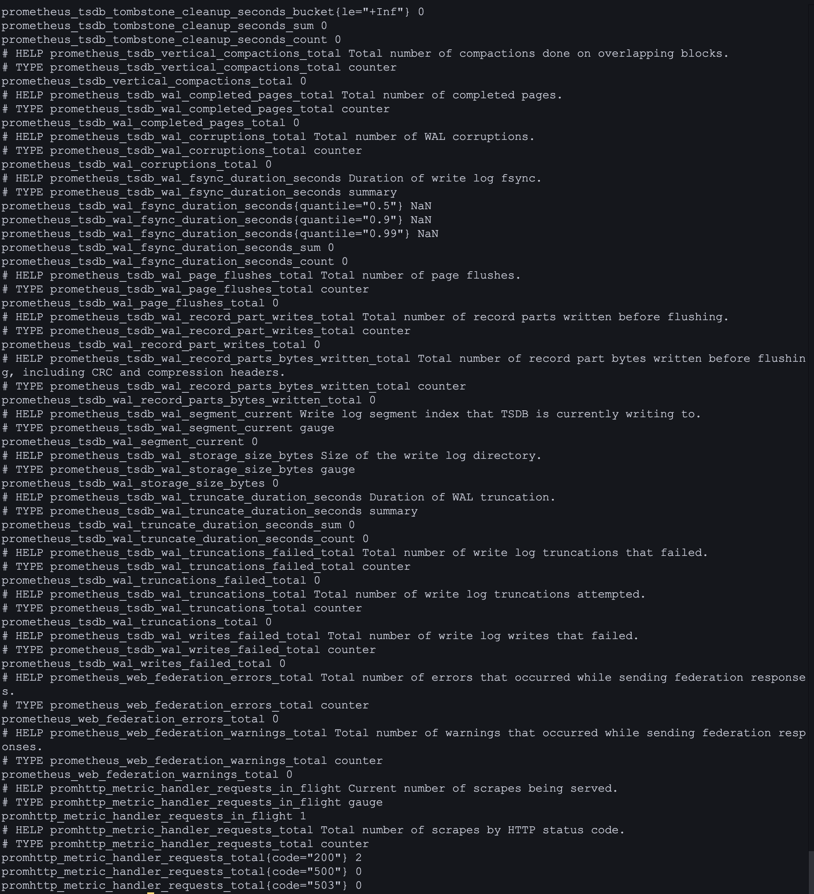