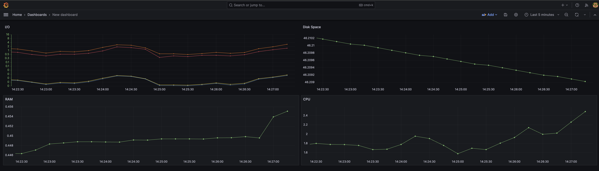
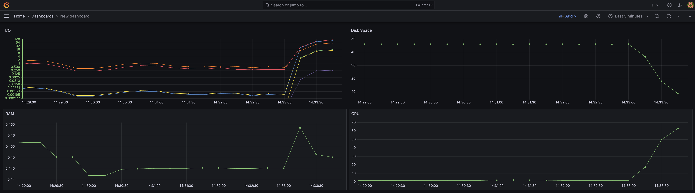
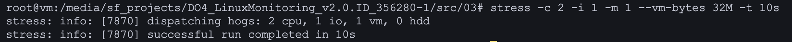
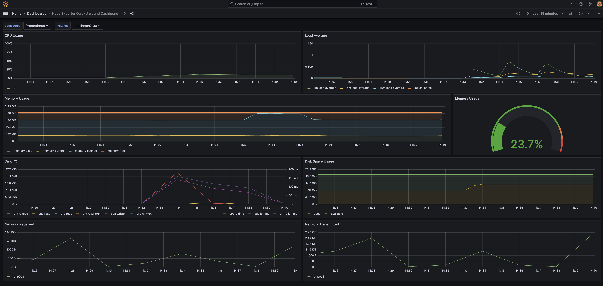
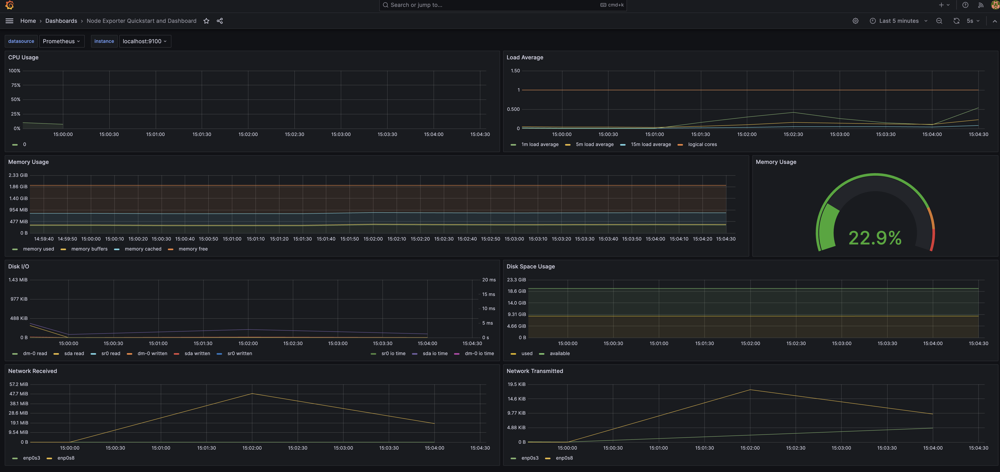
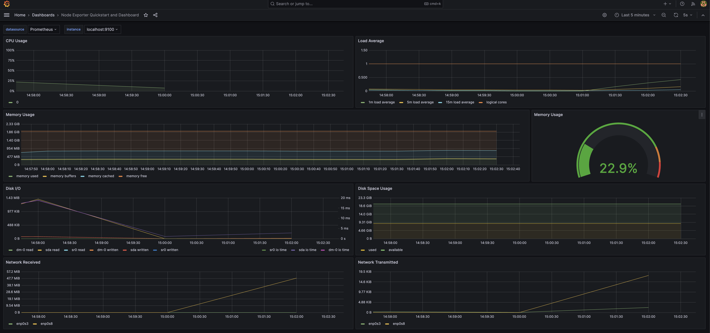
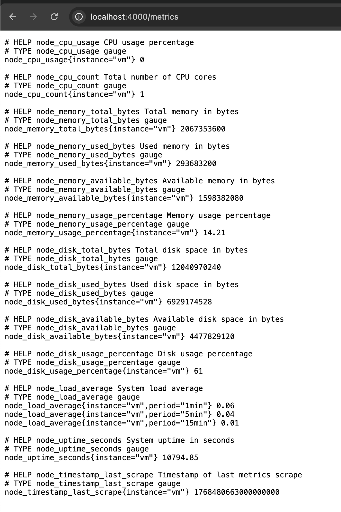
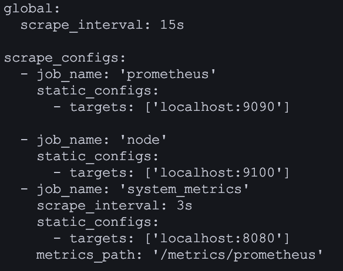
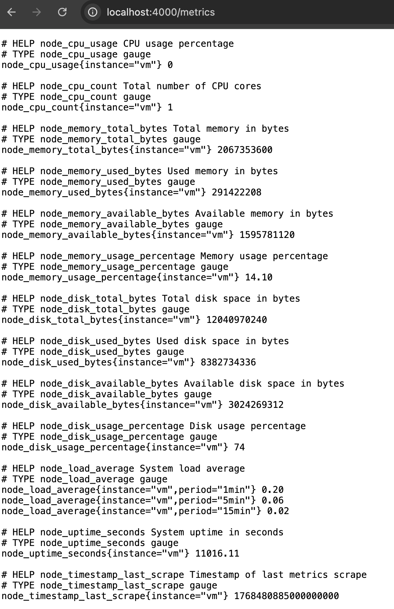
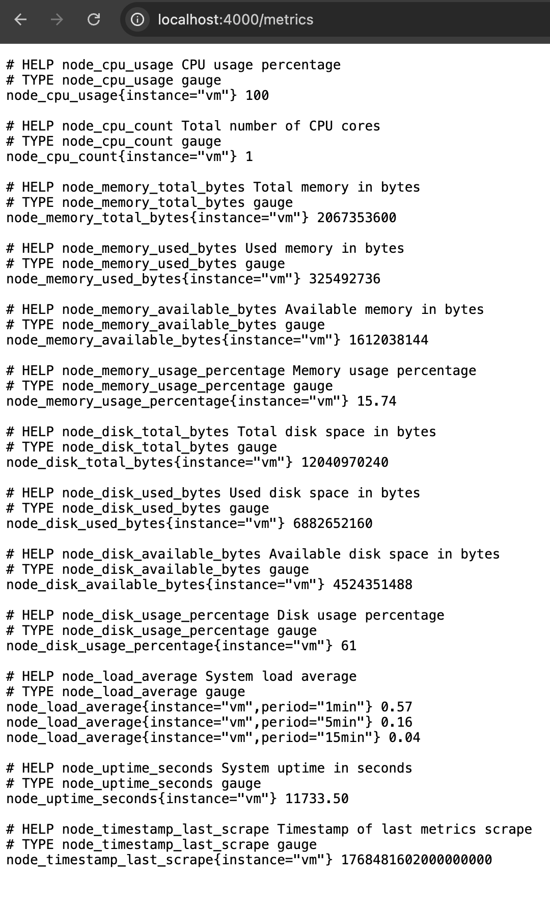

Part 6. GoAccess
Смотреть на результаты трудов в консоли, конечно, неплохо, но почему бы дополнительно не воспользоваться готовым решением, предоставляющим удобный интерфейс?

== Задание ==

С помощью утилиты GoAccess получи ту же информацию, что и в Части 5.
```
goaccess -i ../04/*.log -o index.html --log-format=COMBINED
```
Открой веб-интерфейс утилиты на локальной машине.

## Part 7. **Prometheus** и **Grafana**

Практика с логами пока что окончена. Теперь пришло время мониторить состояние системы в целом.

**== Задание ==**

##### Установи и настрой **Prometheus** и **Grafana** на виртуальную машину.
##### Получи доступ к веб-интерфейсам **Prometheus** и **Grafana** с локальной машины.

##### Добавь на дашборд **Grafana** отображение ЦПУ, доступной оперативной памяти, свободное место и кол-во операций ввода/вывода на жестком диске.


##### Запусти свой bash-скрипт из [Части 2](#part-2-засорение-файловой-системы).
##### Посмотри на нагрузку жесткого диска (место на диске и операции чтения/записи).


##### Установи утилиту **stress** и запусти команду `stress -c 2 -i 1 -m 1 --vm-bytes 32M -t 10s`
##### Посмотри на нагрузку жесткого диска, оперативной памяти и ЦПУ.



## Part 8. Готовый дашборд

Собственно, зачем составлять собственный дашборд, если, как говорится, «всё уже украдено до нас»?
Почему бы не взять готовый дашборд, на котором есть все нужные метрики?

**== Задание ==**

##### Установи готовый дашборд *Node Exporter Quickstart and Dashboard* с официального сайта **Grafana Labs**.

##### Проведи те же тесты, что и в [Части 7](#part-7-prometheus-и-grafana).


##### Запусти ещё одну виртуальную машину, находящуюся в одной сети с текущей.
##### Запусти тест нагрузки сети с помощью утилиты **iperf3**.

##### Посмотри на нагрузку сетевого интерфейса.

## Part 9. Дополнительно. Свой *node_exporter*

Анализировать систему с помощью специальных утилит полезно и удобно, но тебе всегда хотелось понять, как же они работают.

**== Задание ==**

Напиши bash-скрипт или программу на С, собирающие информацию по базовым метрикам системы (ЦПУ, оперативная память, жесткий диск (объем)).
Скрипт или программа должна формировать html страничку по формату **Prometheus**, которую будет отдавать **nginx**. \
Саму страничку обновлять можно как внутри bash-скрипта или программы (в цикле), так и при помощи утилиты cron, но не чаще, чем раз в 3 секунды.
- Написал скрипт, добавил его как демона в систему для автоматического запуска и работы. Скрипт генерирует html страничку и файл с данными для Prometheus. Nginx настроил на 8080 порт с эндпоинтом /metrics для просмотра страницы, и /metrics/prometheus - для получения данных для Prometheus'a.

- HTML страничка
##### Поменяй конфигурационный файл **Prometheus**, чтобы он собирал информацию с созданной тобой странички.

##### Проведи те же тесты, что и в [Части 7](#part-7-prometheus-и-grafana).

- Данные после запуска скрипта

- Данные после запуска stress