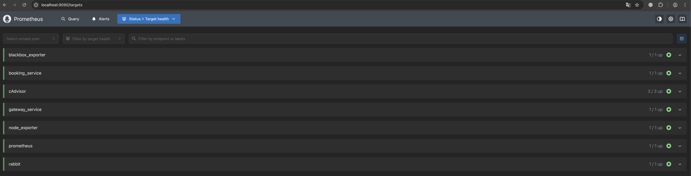
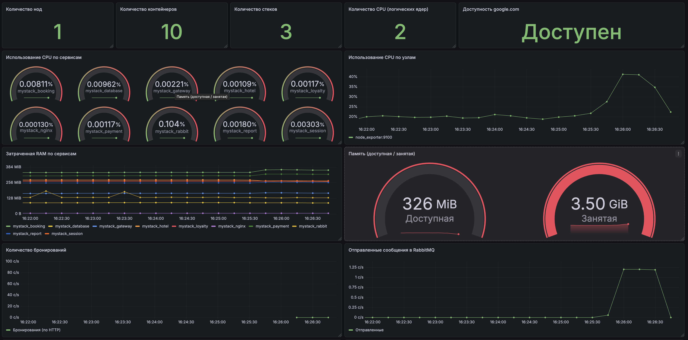
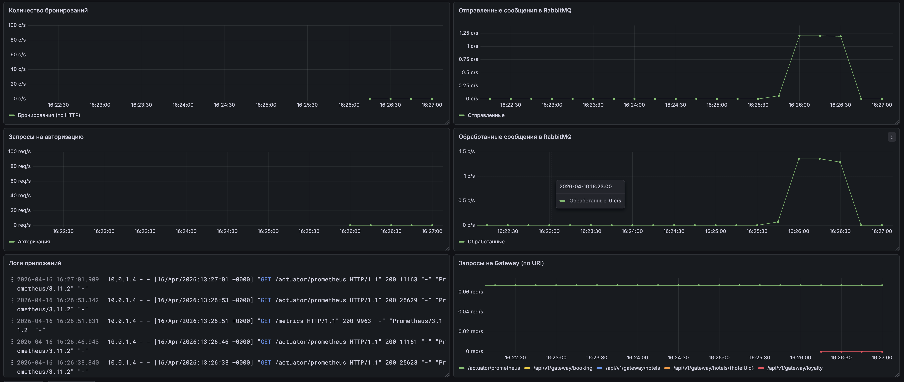
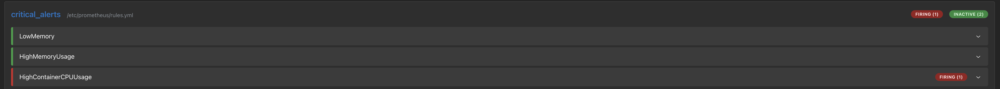
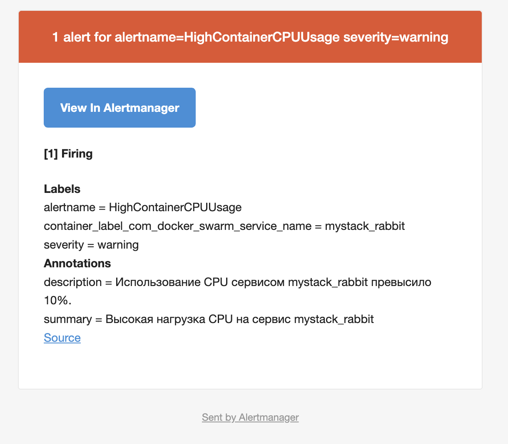

## Part 1. Получение метрик и логов

1. Использовать Docker Swarm из первого проекта. 

2. Написать при помощи библиотеки Micrometer сборщики следующих метрик приложения: 
   - количество отправленных сообщений в rabbitmq;
   - количество обработанных сообщений в rabbitmq;
   - количество бронирований;
   - количество полученных запросов на gateway;
   - количество полученных запросов на авторизацию пользователей.

- Для получения количества бронирований, запросов на gateway и авторизацию пользователей добавил зависимости в pom.xml соотвествующих сервисов:

    <details>
    <summary>Добавленные зависимости</summary>

    ```java
            <dependency>
                <groupId>io.micrometer</groupId>
                <artifactId>micrometer-registry-prometheus</artifactId>
            </dependency>
            <dependency>
                <groupId>org.springframework.boot</groupId>
                <artifactId>spring-boot-starter-actuator</artifactId>
            </dependency>
    ```

    </details>


- Для rabbitmq использовал новый docker-образ с вшитым сбором метрик
    rabbitmq:3-management-alpine

3. Добавить логи приложения с помощью Loki.

    <details>
    <summary>Проверяем сервисы которые отдают логи в Loki</summary>

    ```sh
    vagrant@worker02:~$ curl -s 'http://localhost:3100/loki/api/v1/label/swarm_service/values' | jq '.'
    {
    "status": "success",
    "data": [
        "monitoring_blackbox_exporter",
        "monitoring_cadvisor",
        "monitoring_grafana",
        "monitoring_loki",
        "monitoring_node_exporter",
        "monitoring_prometheus",
        "monitoring_promtail",
        "mystack_booking",
        "mystack_database",
        "mystack_gateway",
        "mystack_hotel",
        "mystack_loyalty",
        "mystack_nginx",
        "mystack_payment",
        "mystack_rabbit",
        "mystack_report",
        "mystack_session"
    ]
    }
    ```

    </details>


4. Создать новый стек для Docker Swarm из сервисов с Prometheus Server, Loki, node_exporter, blackbox_exporter, cAdvisor. Проверить получение метрик на порту 9090 через браузер.

- Новый стек:

    <details>
    <summary>docker-compose.monitoring.yml</summary>

    ```yml
    version: '3.8'

    services:
    prometheus:
        image: prom/prometheus:latest
        hostname: prometheus
        restart: unless-stopped
        expose:
        - "9090"
        ports:
        - "9090:9090"
        volumes:
        - /home/vagrant/metrics/prometheus/prometheus.yml:/etc/prometheus/prometheus.yml
        - /var/run/docker.sock:/var/run/docker.sock:ro  
        - /home/vagrant/metrics/alert/rules.yml:/etc/prometheus/rules.yml
        networks:
        - monitoring
        - shared

    promtail:
        image: grafana/promtail:latest
        hostname: promtail
        volumes:
        - /var/run/docker.sock:/var/run/docker.sock
        - /var/lib/docker/containers:/var/lib/docker/containers:ro
        configs:
        - source: promtail_config
            target: /etc/promtail/config.yml
        command: -config.file=/etc/promtail/config.yml
        networks:
        - monitoring
        - shared
        deploy:
        mode: global
        placement:
            constraints:
            - node.platform.os == linux

    alertmanager:
        image: prom/alertmanager:latest
        hostname: alertmanager
        ports:
        - "9093:9093"
        configs:
        - source: alertmanager_config
            target: /etc/alertmanager/alertmanager.yml
        networks:
        - monitoring
        - shared

    telegram_webhook:
        image: ghcr.io/d13410n3/am-telegram:latest
        environment:
        - TELEGRAM_BOT_TOKEN=token
        - TELEGRAM_CHAT_ID=chat
        - GRAFANA_BASE_URL=http://grafana:3000
        - PROM_BASE_URL=http://prometheus:9090
        - AM_BASE_URL=http://alertmanager:9093
        ports:
        - "8080:8080"
        networks:
        - monitoring
        - shared

    loki:
        hostname: loki
        image: grafana/loki:latest
        expose:
        - "3100"
        ports:
        - "3100:3100"
        networks:
        - monitoring
        - shared
    
    grafana:
        image: grafana/grafana:latest
        hostname: grafana
        expose:
        - "3000"
        volumes:
        - grafana-storage:/var/lib/grafana
        - /home/vagrant/metrics/grafana/datasources:/etc/grafana/provisioning/datasources:ro
        - /home/vagrant/metrics/grafana/dashboards:/etc/grafana/provisioning/dashboards:ro
        ports:
        - "3000:3000"
        environment:
        - GF_SECURITY_ADMIN_PASSWORD=admin
        networks:
        - monitoring
    
    node_exporter:
        image: prom/node-exporter:latest
        hostname: nodeexporter
        restart: unless-stopped
        expose:
        - "9100"
        networks:
        - monitoring

    blackbox_exporter:
        image: prom/blackbox-exporter:latest
        
        hostname: blackboxexporter
        restart: unless-stopped
        expose:
        - "9115"
        networks:
        - monitoring

    cadvisor:
        image: gcr.io/cadvisor/cadvisor:latest
        hostname: cadvisor
        restart: unless-stopped
        expose:
        - "8080"
        networks:
        - monitoring
        volumes:
            - /:/rootfs:ro
            - /var/run:/var/run:ro
            - /sys:/sys:ro
            - /var/lib/docker/:/var/lib/docker:ro
            - /dev/disk/:/dev/disk:ro 
        deploy:
        mode: global
        placement:
            constraints:
            - node.platform.os == linux

    volumes:
    grafana-storage:
        external: true
    configs:
    loki_config:
        file: /home/vagrant/metrics/loki/loki-config.yml
    promtail_config:
        file: /home/vagrant/metrics/promtail/promtail-config.yml
    alertmanager_config:
        file: /home/vagrant/metrics/alert/alertmanager.yml
    networks:
    monitoring:
        driver: overlay
    shared:
        external: true
    ```

    </details>

- 

## Part 2. Визуализация

1. Развернуть grafana как новый сервис в стеке мониторинга.

2. Добавить в Grafana дашборд со следующими метриками:
   - количество нод;
   - количество контейнеров;
   - количество стеков;
   - использование CPU по сервисам;
   - использование CPU по ядрам и узлам;
   - затраченная RAM;
   - доступная и занятая память;
   - количество CPU;
   - доступность google.com;
   - количество отправленных сообщений в rabbitmq;
   - количество обработанных сообщений в rabbitmq;
   - количество бронирований;
   - количество полученных запросов на gateway;
   - количество полученных запросов на авторизацию пользователей;
   - логи приложения.

- 
- 

## Part 3. Отслеживание критических событий

1. Развернуть Alert Manager как новый сервис в стеке монтиторинга.

- Добавил alertmanager и telegram_webhook для отправки сообщений в телеграм в стек мониторинга
    <details>
    <summary>compose файл</summary>

    ```yml
    alertmanager:
        image: prom/alertmanager:latest
        hostname: alertmanager
        ports:
        - "9093:9093"
        configs:
        - source: alertmanager_config
        target: /etc/alertmanager/alertmanager.yml
        networks:
        - monitoring
        - shared
    telegram_webhook:
        image: ghcr.io/d13410n3/am-telegram:latest
        environment:
        - TELEGRAM_BOT_TOKEN=token
        - TELEGRAM_CHAT_ID=chat
        - GRAFANA_BASE_URL=http://grafana:3000
        - PROM_BASE_URL=http://prometheus:9090
        - AM_BASE_URL=http://alertmanager:9093
        ports:
        - "8080:8080"
        networks:
        - monitoring
        - shared
    ```

    </details>


2. Добавить следующие критические события:
   - доступная память меньше 100 Мб;
   - затраченная RAM больше 1 Гб;
   - использование CPU по сервису превышает 10%.


- 
   
    <details>
    <summary>Файл с правилами</summary>

    ```yml
    groups:
  - name: critical_alerts
    rules:
      - alert: LowMemory
        expr: node_memory_MemAvailable_bytes < 100 * 1024 * 1024
        for: 1m
        labels:
          severity: critical
        annotations:
          summary: "Низкий объем свободной памяти на {{ $labels.instance }}"
          description: "Доступная память на узле {{ $labels.instance }} упала ниже 100MB. Текущее значение: {{ $value | humanize }}MB."

      - alert: HighMemoryUsage
        expr: sum(container_memory_working_set_bytes{container_label_com_docker_swarm_service_name=~"mystack_.+"}) by (container_label_com_docker_swarm_service_name) > 1e+09
        for: 2m
        labels:
          severity: critical
        annotations:
          summary: "Высокое потребление RAM сервисом {{ $labels.container_label_com_docker_swarm_service_name }}"
          description: "Сервис {{ $labels.container_label_com_docker_swarm_service_name }} использует более 1GB RAM. Текущее использование: {{ $value | humanize }}MB."

      - alert: HighContainerCPUUsage
        expr: sum(rate(container_cpu_usage_seconds_total{container_label_com_docker_swarm_service_name=~"mystack_.+"}[2m])) by (container_label_com_docker_swarm_service_name) * 100 > 10
        for: 2m
        labels:
          severity: warning
        annotations:
          summary: "Высокая нагрузка CPU на сервис {{ $labels.container_label_com_docker_swarm_service_name }}"
          description: "Использование CPU сервисом {{ $labels.container_label_com_docker_swarm_service_name }} превысило 10%."
    ```

    </details>

3. Настроить получение оповещений через личные email и Телеграм.

- 